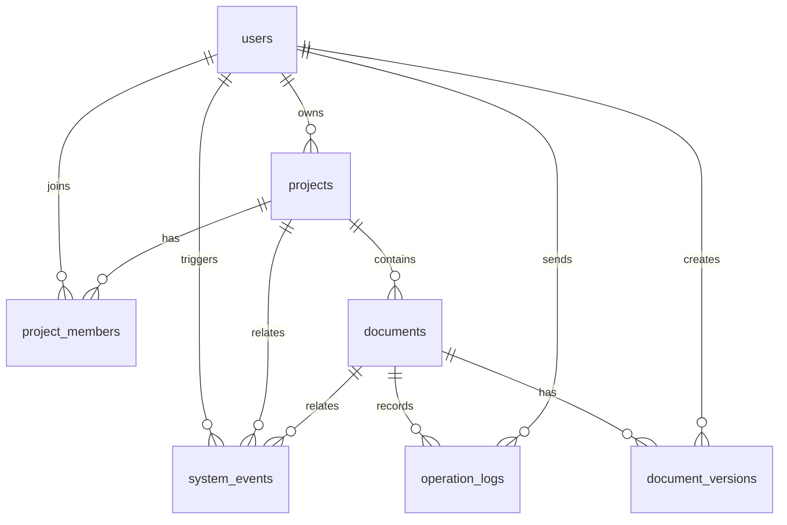

# 基于云的协同机械 CAD 系统数据库与数据模型设计文档

## 1. 文档说明

### 1.1 文档目的

本文档是“基于云的协同机械 CAD 系统”的第 07 阶段产物，用于在需求分析、概要设计、系统架构设计和详细设计的基础上，明确数据库结构、数据模型、表关系、字段类型、索引、约束、JSONB 快照结构和 Flyway 迁移方案。

开发人员阅读本文后，应能够明确：

1. PostgreSQL 中需要创建哪些表。
2. 每张表保存什么数据。
3. 表之间如何关联。
4. CAD 模型快照 JSON 应如何组织。
5. 版本、操作日志和系统事件如何存储。
6. 后端 JPA Entity 与数据库表如何对应。
7. 后续编码时 Flyway 迁移脚本如何编写。

### 1.2 设计依据

本文档依据：

1. `02-需求分析文档.md`
2. `03-概要设计文档.md`
3. `05-系统架构设计文档.md`
4. `06-详细设计文档.md`
5. `02附件-实验最低要求核验与补充设计.md`

### 1.3 数据库选型结论

本项目使用：

```text
PostgreSQL + JSONB + Flyway + Spring Data JPA/Hibernate
```

选择原因：

1. 用户、项目、权限、版本等适合关系数据库。
2. CAD 模型快照结构复杂且会演进，适合使用 JSONB。
3. PostgreSQL 同时支持关系约束和 JSONB 查询。
4. Flyway 可以保证数据库结构可版本化、可迁移。
5. Spring Data JPA 能降低常规 CRUD 代码成本。

### 1.4 设计原则

数据库设计遵循：

1. 主业务数据关系化：用户、项目、成员、文档、版本使用关系表。
2. CAD 模型快照 JSON 化：草图、特征树和约束存入 JSONB。
3. 版本不可覆盖：每次保存生成新的 `document_versions` 记录。
4. 当前文档快速读取：`documents` 保存当前版本号和当前快照。
5. 协同操作可追踪：所有关键 operation 写入 `operation_logs`。
6. 运行状态可观测：登录、WebSocket、权限拒绝等写入 `system_events`。
7. MVP 简化：在线用户和远程光标不落库，首版存在内存中。

## 2. 数据范围与边界

### 2.1 需要持久化的数据

| 数据类型 | 表 | 说明 |
| --- | --- | --- |
| 用户 | `users` | 注册用户、密码哈希、账号状态 |
| 项目 | `projects` | CAD 项目基本信息 |
| 项目成员 | `project_members` | 用户在项目中的角色和权限 |
| 文档 | `documents` | CAD 文档元数据和当前快照 |
| 文档版本 | `document_versions` | 每次保存形成的历史版本 |
| 操作日志 | `operation_logs` | 协同操作、建模操作、Undo/Redo |
| 系统事件 | `system_events` | 登录、连接、权限拒绝、错误事件 |

### 2.2 不在 MVP 中持久化的数据

| 数据 | 原因 | MVP 处理方式 |
| --- | --- | --- |
| 在线用户列表 | 实时状态，变化频繁 | 后端内存 Map |
| 远程光标 | 高频临时数据 | WebSocket 广播 |
| Three.js Mesh | 可由模型快照重建 | 前端内存 |
| Undo/Redo 栈 | 本地会话状态 | 前端内存 |
| OpenCascade.js B-Rep | P1/P2 增强项 | 暂不进入主表 |
| 导出 STL/glTF 文件 | 非 MVP 必须 | 后续 OBS |

### 2.3 后续可扩展的数据

后续可以增加：

1. `document_locks`：对象级锁或文档级锁。
2. `file_assets`：导出文件、附件、缩略图。
3. `refresh_tokens`：长期登录与多端管理。
4. `notifications`：协同通知。
5. `document_branches`：版本分支。
6. `model_exports`：STL、glTF、STEP 导出记录。

## 3. 总体实体关系

### 3.1 ER 关系图



### 3.2 核心关系说明

1. 一个用户可以拥有多个项目。
2. 一个项目可以有多个成员。
3. 一个项目可以有多个 CAD 文档。
4. 一个 CAD 文档可以有多个历史版本。
5. 一个文档当前版本由 `documents.current_version_id` 指向。
6. 一个用户可以创建多个版本。
7. operation log 记录某个用户对某个文档做过什么操作。
8. system event 记录系统运行过程中的关键事件。

### 3.3 ID 设计

数据库主键统一使用：

```sql
bigserial primary key
```

原因：

1. Java 后端可直接映射为 `Long`。
2. Spring Data JPA 使用简单。
3. 课程项目中不需要复杂分布式 ID。

前端 CAD 模型内部对象 id 使用字符串：

```text
sketch-001
rect-001
extrude-001
operation-001
```

说明：

1. 数据库表 id 用于后端资源标识。
2. CAD JSON 内部 id 用于草图、特征、约束、operation。
3. 两类 id 不混用。

## 4. 命名规范

### 4.1 表命名

规则：

1. 使用小写英文复数。
2. 多个单词用下划线。
3. 不使用数据库保留字。

示例：

```text
users
projects
project_members
documents
document_versions
operation_logs
system_events
```

### 4.2 字段命名

规则：

1. 使用小写英文。
2. 多个单词用下划线。
3. 外键以 `_id` 结尾。
4. 时间字段以 `_at` 结尾。
5. 布尔字段使用 `is_` 或语义明确名称。

示例：

```text
created_at
updated_at
owner_id
project_id
document_id
current_version_id
password_hash
```

### 4.3 Java 命名映射

数据库字段使用 snake_case，Java 字段使用 camelCase。

| 数据库字段 | Java 字段 |
| --- | --- |
| `created_at` | `createdAt` |
| `password_hash` | `passwordHash` |
| `current_version_id` | `currentVersionId` |
| `snapshot_json` | `snapshotJson` |

### 4.4 枚举字段设计

MVP 阶段不使用 PostgreSQL enum 类型，而使用 `varchar + check constraint`。

原因：

1. 修改 PostgreSQL enum 比修改 check constraint 更麻烦。
2. 课程项目迭代中角色和事件类型可能调整。
3. JPA 映射字符串更直观。

示例：

```sql
role varchar(32) not null check (role in ('OWNER', 'EDITOR', 'VIEWER'))
```

## 5. 表结构详细设计

### 5.1 `users` 用户表

用途：

保存系统注册用户、登录信息和账号状态。

字段设计：

| 字段 | 类型 | 约束 | 说明 |
| --- | --- | --- | --- |
| `id` | `bigserial` | PK | 用户主键 |
| `username` | `varchar(64)` | not null unique | 用户名 |
| `email` | `varchar(128)` | not null unique | 邮箱 |
| `password_hash` | `varchar(255)` | not null | BCrypt 哈希 |
| `display_name` | `varchar(64)` | nullable | 显示名称 |
| `enabled` | `boolean` | not null default true | 是否启用 |
| `created_at` | `timestamptz` | not null | 创建时间 |
| `updated_at` | `timestamptz` | not null | 更新时间 |

建表 SQL：

```sql
create table users (
    id bigserial primary key,
    username varchar(64) not null,
    email varchar(128) not null,
    password_hash varchar(255) not null,
    display_name varchar(64),
    enabled boolean not null default true,
    created_at timestamptz not null default now(),
    updated_at timestamptz not null default now(),
    constraint uk_users_username unique (username),
    constraint uk_users_email unique (email)
);
```

索引：

```sql
create index idx_users_enabled on users(enabled);
```

说明：

1. 登录时通过 username 查询。
2. 注册时需要校验 username 和 email 唯一。
3. password_hash 不能返回给前端。

### 5.2 `projects` 项目表

用途：

保存 CAD 项目基本信息。

字段设计：

| 字段 | 类型 | 约束 | 说明 |
| --- | --- | --- | --- |
| `id` | `bigserial` | PK | 项目主键 |
| `name` | `varchar(128)` | not null | 项目名称 |
| `description` | `text` | nullable | 项目描述 |
| `owner_id` | `bigint` | FK users | 项目拥有者 |
| `deleted` | `boolean` | not null default false | 是否软删除 |
| `created_at` | `timestamptz` | not null | 创建时间 |
| `updated_at` | `timestamptz` | not null | 更新时间 |

建表 SQL：

```sql
create table projects (
    id bigserial primary key,
    name varchar(128) not null,
    description text,
    owner_id bigint not null references users(id),
    deleted boolean not null default false,
    created_at timestamptz not null default now(),
    updated_at timestamptz not null default now()
);
```

索引：

```sql
create index idx_projects_owner_id on projects(owner_id);
create index idx_projects_deleted on projects(deleted);
```

说明：

1. 项目删除建议使用软删除。
2. 项目拥有者同时应在 `project_members` 中有 OWNER 角色。
3. 查询我的项目时主要通过 `project_members` 查询。

### 5.3 `project_members` 项目成员表

用途：

保存用户与项目之间的成员关系和角色权限。

字段设计：

| 字段 | 类型 | 约束 | 说明 |
| --- | --- | --- | --- |
| `id` | `bigserial` | PK | 成员关系主键 |
| `project_id` | `bigint` | FK projects | 项目 |
| `user_id` | `bigint` | FK users | 用户 |
| `role` | `varchar(32)` | not null check | 角色 |
| `created_at` | `timestamptz` | not null | 加入时间 |
| `updated_at` | `timestamptz` | not null | 更新时间 |

角色：

| 角色 | 权限 |
| --- | --- |
| OWNER | 项目管理、成员管理、文档读写 |
| EDITOR | 文档读写、协同编辑 |
| VIEWER | 只读查看、可进入协同房间但不能编辑 |

建表 SQL：

```sql
create table project_members (
    id bigserial primary key,
    project_id bigint not null references projects(id) on delete cascade,
    user_id bigint not null references users(id) on delete cascade,
    role varchar(32) not null,
    created_at timestamptz not null default now(),
    updated_at timestamptz not null default now(),
    constraint uk_project_members_project_user unique (project_id, user_id),
    constraint ck_project_members_role check (role in ('OWNER', 'EDITOR', 'VIEWER'))
);
```

索引：

```sql
create index idx_project_members_user_id on project_members(user_id);
create index idx_project_members_project_id on project_members(project_id);
create index idx_project_members_role on project_members(role);
```

说明：

1. `(project_id, user_id)` 必须唯一。
2. 用户是否能访问项目由该表决定。
3. OWNER 角色至少应有一人，MVP 可以由业务逻辑保证。

### 5.4 `documents` CAD 文档表

用途：

保存 CAD 文档元数据和当前快照，支持快速打开工作台。

字段设计：

| 字段 | 类型 | 约束 | 说明 |
| --- | --- | --- | --- |
| `id` | `bigserial` | PK | 文档主键 |
| `project_id` | `bigint` | FK projects | 所属项目 |
| `name` | `varchar(128)` | not null | 文档名称 |
| `current_version_id` | `bigint` | nullable FK | 当前版本 id |
| `current_version_number` | `integer` | not null default 0 | 当前版本号 |
| `snapshot_json` | `jsonb` | nullable | 当前模型快照 |
| `created_by` | `bigint` | FK users | 创建人 |
| `updated_by` | `bigint` | FK users nullable | 最后更新人 |
| `deleted` | `boolean` | not null default false | 是否软删除 |
| `created_at` | `timestamptz` | not null | 创建时间 |
| `updated_at` | `timestamptz` | not null | 更新时间 |

建表 SQL：

```sql
create table documents (
    id bigserial primary key,
    project_id bigint not null references projects(id) on delete cascade,
    name varchar(128) not null,
    current_version_id bigint,
    current_version_number integer not null default 0,
    snapshot_json jsonb,
    created_by bigint not null references users(id),
    updated_by bigint references users(id),
    deleted boolean not null default false,
    created_at timestamptz not null default now(),
    updated_at timestamptz not null default now(),
    constraint ck_documents_current_version_number check (current_version_number >= 0)
);
```

`current_version_id` 外键需要在 `document_versions` 创建后追加：

```sql
alter table documents
    add constraint fk_documents_current_version
    foreign key (current_version_id) references document_versions(id) on delete set null;
```

索引：

```sql
create index idx_documents_project_id on documents(project_id);
create index idx_documents_deleted on documents(deleted);
create index idx_documents_current_version_id on documents(current_version_id);
create index idx_documents_snapshot_json_gin on documents using gin (snapshot_json);
```

说明：

1. `snapshot_json` 保存当前版本快照，用于快速加载。
2. `document_versions` 保存历史版本。
3. `current_version_number` 用于保存冲突判断。
4. `current_version_id` 用于快速定位当前版本详情。

### 5.5 `document_versions` 文档版本表

用途：

保存每次保存产生的历史版本。版本记录不可覆盖、不可原地修改。

字段设计：

| 字段 | 类型 | 约束 | 说明 |
| --- | --- | --- | --- |
| `id` | `bigserial` | PK | 版本主键 |
| `document_id` | `bigint` | FK documents | 文档 |
| `version_number` | `integer` | not null | 版本号 |
| `snapshot_json` | `jsonb` | nullable | 模型快照 |
| `snapshot_path` | `varchar(512)` | nullable | OBS 或本地文件路径 |
| `created_by` | `bigint` | FK users | 保存人 |
| `message` | `varchar(255)` | nullable | 保存说明 |
| `created_at` | `timestamptz` | not null | 创建时间 |

建表 SQL：

```sql
create table document_versions (
    id bigserial primary key,
    document_id bigint not null references documents(id) on delete cascade,
    version_number integer not null,
    snapshot_json jsonb,
    snapshot_path varchar(512),
    created_by bigint not null references users(id),
    message varchar(255),
    created_at timestamptz not null default now(),
    constraint uk_document_versions_doc_version unique (document_id, version_number),
    constraint ck_document_versions_number check (version_number >= 1),
    constraint ck_document_versions_snapshot check (
        snapshot_json is not null or snapshot_path is not null
    )
);
```

索引：

```sql
create index idx_document_versions_document_id on document_versions(document_id);
create index idx_document_versions_created_by on document_versions(created_by);
create index idx_document_versions_created_at on document_versions(created_at);
create index idx_document_versions_snapshot_json_gin on document_versions using gin (snapshot_json);
```

说明：

1. 同一文档下版本号必须唯一。
2. MVP 使用 `snapshot_json`。
3. 后续模型过大时使用 `snapshot_path` 指向 OBS。
4. 恢复历史版本时，不修改旧版本，而是创建新版本。

### 5.6 `operation_logs` 操作日志表

用途：

记录 CAD 操作和协同操作，用于调试、追踪和答辩演示。

字段设计：

| 字段 | 类型 | 约束 | 说明 |
| --- | --- | --- | --- |
| `id` | `bigserial` | PK | 日志主键 |
| `operation_id` | `varchar(64)` | not null | 前端生成的 operation id |
| `document_id` | `bigint` | FK documents | 文档 |
| `user_id` | `bigint` | FK users | 操作用户 |
| `operation_type` | `varchar(64)` | not null | 操作类型 |
| `target_id` | `varchar(128)` | nullable | CAD 对象 id |
| `base_version` | `integer` | nullable | 客户端基准版本 |
| `server_version` | `integer` | nullable | 服务端当前版本 |
| `operation_payload` | `jsonb` | not null | 操作内容 |
| `created_at` | `timestamptz` | not null | 创建时间 |

建表 SQL：

```sql
create table operation_logs (
    id bigserial primary key,
    operation_id varchar(64) not null,
    document_id bigint not null references documents(id) on delete cascade,
    user_id bigint not null references users(id),
    operation_type varchar(64) not null,
    target_id varchar(128),
    base_version integer,
    server_version integer,
    operation_payload jsonb not null,
    created_at timestamptz not null default now()
);
```

索引：

```sql
create index idx_operation_logs_document_id on operation_logs(document_id);
create index idx_operation_logs_user_id on operation_logs(user_id);
create index idx_operation_logs_operation_type on operation_logs(operation_type);
create index idx_operation_logs_target_id on operation_logs(target_id);
create index idx_operation_logs_created_at on operation_logs(created_at);
create index idx_operation_logs_payload_gin on operation_logs using gin (operation_payload);
```

说明：

1. operation log 不作为恢复文档的唯一依据。
2. 文档恢复以 `document_versions.snapshot_json` 为准。
3. operation log 主要服务协同调试和演示。
4. `operation_id` 可以辅助排查重复消息。

### 5.7 `system_events` 系统事件表

用途：

记录系统运行事件，支持可观测性、问题排查和部署演示。

字段设计：

| 字段 | 类型 | 约束 | 说明 |
| --- | --- | --- | --- |
| `id` | `bigserial` | PK | 事件主键 |
| `trace_id` | `varchar(64)` | nullable | 链路追踪 id |
| `user_id` | `bigint` | nullable FK users | 相关用户 |
| `project_id` | `bigint` | nullable FK projects | 相关项目 |
| `document_id` | `bigint` | nullable FK documents | 相关文档 |
| `event_type` | `varchar(64)` | not null | 事件类型 |
| `event_payload` | `jsonb` | nullable | 事件详情 |
| `result` | `varchar(32)` | not null | 成功、失败、拒绝 |
| `created_at` | `timestamptz` | not null | 创建时间 |

建表 SQL：

```sql
create table system_events (
    id bigserial primary key,
    trace_id varchar(64),
    user_id bigint references users(id),
    project_id bigint references projects(id) on delete set null,
    document_id bigint references documents(id) on delete set null,
    event_type varchar(64) not null,
    event_payload jsonb,
    result varchar(32) not null,
    created_at timestamptz not null default now(),
    constraint ck_system_events_result check (result in ('SUCCESS', 'FAILED', 'DENIED', 'WARNING'))
);
```

索引：

```sql
create index idx_system_events_trace_id on system_events(trace_id);
create index idx_system_events_user_id on system_events(user_id);
create index idx_system_events_project_id on system_events(project_id);
create index idx_system_events_document_id on system_events(document_id);
create index idx_system_events_event_type on system_events(event_type);
create index idx_system_events_created_at on system_events(created_at);
create index idx_system_events_payload_gin on system_events using gin (event_payload);
```

事件类型建议：

| 类型 | 说明 |
| --- | --- |
| `AUTH_REGISTER` | 用户注册 |
| `AUTH_LOGIN` | 用户登录 |
| `AUTH_LOGOUT` | 用户登出 |
| `PROJECT_CREATED` | 项目创建 |
| `DOCUMENT_SAVED` | 文档保存 |
| `VERSION_RESTORED` | 版本恢复 |
| `WS_CONNECTED` | WebSocket 连接 |
| `WS_DISCONNECTED` | WebSocket 断开 |
| `ROOM_JOINED` | 加入协同房间 |
| `ROOM_LEFT` | 离开协同房间 |
| `PERMISSION_DENIED` | 权限拒绝 |
| `CONFLICT_DETECTED` | 协同冲突 |
| `SAVE_FAILED` | 保存失败 |

## 6. CAD 模型 JSONB 详细设计

### 6.1 快照总体结构

`documents.snapshot_json` 和 `document_versions.snapshot_json` 使用相同结构。

```json
{
  "schemaVersion": "1.0",
  "documentId": "1",
  "name": "Demo Part",
  "unit": "mm",
  "metadata": {
    "currentVersion": 1,
    "createdAt": "2026-06-17T00:00:00Z",
    "updatedAt": "2026-06-17T00:00:00Z"
  },
  "sketches": [],
  "features": []
}
```

字段说明：

| 字段 | 类型 | 必填 | 说明 |
| --- | --- | --- | --- |
| `schemaVersion` | string | 是 | CAD JSON 结构版本 |
| `documentId` | string | 是 | 文档 id 字符串 |
| `name` | string | 是 | 文档名称 |
| `unit` | string | 是 | 单位，MVP 固定 `mm` |
| `metadata` | object | 是 | 元数据 |
| `sketches` | array | 是 | 草图数组 |
| `features` | array | 是 | 特征数组 |

### 6.2 草图 JSON 结构

```json
{
  "id": "sketch-001",
  "name": "Sketch 1",
  "plane": "XY",
  "entities": [],
  "constraints": []
}
```

字段说明：

| 字段 | 类型 | 必填 | 说明 |
| --- | --- | --- | --- |
| `id` | string | 是 | 草图 id |
| `name` | string | 是 | 草图名称 |
| `plane` | string | 是 | 草图平面，MVP 为 `XY` |
| `entities` | array | 是 | 草图实体 |
| `constraints` | array | 是 | 约束 |

### 6.3 草图实体 JSON 结构

#### 6.3.1 线段

```json
{
  "id": "line-001",
  "type": "line",
  "name": "Line 1",
  "visible": true,
  "start": { "x": 0, "y": 0 },
  "end": { "x": 80, "y": 0 }
}
```

#### 6.3.2 矩形

```json
{
  "id": "rect-001",
  "type": "rectangle",
  "name": "Rectangle 1",
  "visible": true,
  "origin": { "x": 0, "y": 0 },
  "width": 80,
  "height": 40
}
```

#### 6.3.3 圆

```json
{
  "id": "circle-001",
  "type": "circle",
  "name": "Circle 1",
  "visible": true,
  "center": { "x": 20, "y": 20 },
  "radius": 10
}
```

#### 6.3.4 P1 扩展实体

椭圆：

```json
{
  "id": "ellipse-001",
  "type": "ellipse",
  "name": "Ellipse 1",
  "visible": true,
  "center": { "x": 0, "y": 0 },
  "radiusX": 30,
  "radiusY": 15
}
```

多段线：

```json
{
  "id": "polyline-001",
  "type": "polyline",
  "name": "Polyline 1",
  "visible": true,
  "points": [
    { "x": 0, "y": 0 },
    { "x": 50, "y": 0 },
    { "x": 50, "y": 30 }
  ],
  "closed": false
}
```

### 6.4 约束 JSON 结构

固定约束：

```json
{
  "id": "constraint-001",
  "type": "fixed",
  "entityId": "rect-001"
}
```

水平约束：

```json
{
  "id": "constraint-002",
  "type": "horizontal",
  "entityId": "line-001"
}
```

垂直约束：

```json
{
  "id": "constraint-003",
  "type": "vertical",
  "entityId": "line-002"
}
```

尺寸约束：

```json
{
  "id": "constraint-004",
  "type": "dimension",
  "entityId": "rect-001",
  "dimension": "width",
  "value": 80
}
```

重合约束：

```json
{
  "id": "constraint-005",
  "type": "coincident",
  "entityIdA": "line-001",
  "pointKeyA": "end",
  "entityIdB": "line-002",
  "pointKeyB": "start"
}
```

### 6.5 特征 JSON 结构

#### 6.5.1 拉伸特征

```json
{
  "id": "extrude-001",
  "type": "extrude",
  "name": "Extrude 1",
  "suppressed": false,
  "sourceSketchId": "sketch-001",
  "sourceEntityId": "rect-001",
  "depth": 30,
  "operation": "new"
}
```

#### 6.5.2 Cut 特征

```json
{
  "id": "cut-001",
  "type": "cut",
  "name": "Cut 1",
  "suppressed": false,
  "targetFeatureId": "extrude-001",
  "toolSketchId": "sketch-002",
  "toolEntityId": "circle-001",
  "depth": 30
}
```

#### 6.5.3 布尔特征

```json
{
  "id": "boolean-001",
  "type": "boolean",
  "name": "Boolean Union 1",
  "suppressed": false,
  "operation": "union",
  "targetFeatureId": "extrude-001",
  "toolFeatureId": "extrude-002"
}
```

布尔 operation 可选值：

```text
union
difference
```

#### 6.5.4 参数化三维基础体

立方体/长方体：

```json
{
  "id": "box-001",
  "type": "box",
  "name": "Box 1",
  "suppressed": false,
  "position": { "x": 0, "y": 0, "z": 0 },
  "length": 60,
  "width": 40,
  "height": 30
}
```

球体：

```json
{
  "id": "sphere-001",
  "type": "sphere",
  "name": "Sphere 1",
  "suppressed": false,
  "position": { "x": 90, "y": 0, "z": 0 },
  "radius": 25
}
```

锥体：

```json
{
  "id": "cone-001",
  "type": "cone",
  "name": "Cone 1",
  "suppressed": false,
  "position": { "x": 150, "y": 0, "z": 0 },
  "baseRadius": 25,
  "height": 50
}
```

设计说明：

1. 参数化基础体保存在 `features` 数组中，不单独建关系表。
2. `position` 使用三维坐标，单位与文档 `unit` 一致，MVP 固定为 mm。
3. 后端只校验 JSON 非空和大小上限，不在后端执行复杂几何计算。
4. 前端加载 `snapshot_json` 后由 Three.js 几何内核按参数重建 mesh。

### 6.6 JSONB 版本演进

`schemaVersion` 用于支持后续模型结构升级。

MVP：

```text
schemaVersion = "1.0"
```

后续可能升级：

| 版本 | 变化 |
| --- | --- |
| `1.1` | 增加材质、颜色、显示状态 |
| `1.2` | 增加装配引用 |
| `2.0` | 接入 OpenCascade.js B-Rep 元数据 |

设计要求：

1. 前端加载快照时检查 `schemaVersion`。
2. 如果版本不兼容，应提示用户。
3. 后端不解析复杂 CAD JSON，只做必要存储和基本校验。

## 7. Operation 数据模型

### 7.1 Operation 总体结构

WebSocket operation 和 `operation_logs.operation_payload` 应保持一致。

```json
{
  "operationId": "op-001",
  "documentId": 1,
  "userId": 2,
  "type": "feature.created",
  "targetId": "extrude-001",
  "baseVersion": 1,
  "payload": {},
  "clientTimestamp": "2026-06-17T00:00:00Z"
}
```

字段说明：

| 字段 | 类型 | 说明 |
| --- | --- | --- |
| `operationId` | string | 前端生成，便于去重和追踪 |
| `documentId` | number | 后端文档 id |
| `userId` | number | 服务端注入，不信任客户端 |
| `type` | string | 操作类型 |
| `targetId` | string | 草图实体或特征 id |
| `baseVersion` | number | 客户端操作基于的版本 |
| `payload` | object | 操作内容 |
| `clientTimestamp` | string | 客户端时间 |

### 7.2 Operation 类型

| 类型 | 说明 |
| --- | --- |
| `sketch.entity.created` | 创建草图实体 |
| `sketch.entity.updated` | 修改草图实体 |
| `sketch.entity.deleted` | 删除草图实体 |
| `constraint.added` | 添加约束 |
| `constraint.removed` | 删除约束 |
| `feature.created` | 创建特征 |
| `feature.updated` | 修改特征 |
| `feature.deleted` | 删除特征 |
| `history.undo` | 撤销 |
| `history.redo` | 重做 |
| `document.saved` | 文档保存 |
| `version.restored` | 恢复版本 |

### 7.3 Operation Payload 示例

创建矩形：

```json
{
  "sketchId": "sketch-001",
  "entity": {
    "id": "rect-001",
    "type": "rectangle",
    "name": "Rectangle 1",
    "visible": true,
    "origin": { "x": 0, "y": 0 },
    "width": 80,
    "height": 40
  }
}
```

修改圆半径：

```json
{
  "sketchId": "sketch-001",
  "entityId": "circle-001",
  "patch": {
    "radius": 15
  }
}
```

创建拉伸：

```json
{
  "feature": {
    "id": "extrude-001",
    "type": "extrude",
    "name": "Extrude 1",
    "suppressed": false,
    "sourceSketchId": "sketch-001",
    "sourceEntityId": "rect-001",
    "depth": 30,
    "operation": "new"
  }
}
```

创建参数化球体：

```json
{
  "feature": {
    "id": "sphere-001",
    "type": "sphere",
    "name": "Sphere 1",
    "suppressed": false,
    "position": { "x": 90, "y": 0, "z": 0 },
    "radius": 25
  }
}
```

### 7.4 Operation 持久化策略

MVP 策略：

1. 所有协同 operation 写入 `operation_logs`。
2. operation 不用于恢复最终模型。
3. 文档恢复以 `document_versions.snapshot_json` 为准。
4. operation log 可用于答辩演示“谁在什么时候做了什么”。

后续增强：

1. 支持按 operation 重放。
2. 支持版本分支。
3. 支持对象级冲突合并。

## 8. JPA Entity 设计

### 8.1 `UserEntity`

```java
@Entity
@Table(name = "users")
public class UserEntity {
    @Id
    @GeneratedValue(strategy = GenerationType.IDENTITY)
    private Long id;

    @Column(nullable = false, unique = true, length = 64)
    private String username;

    @Column(nullable = false, unique = true, length = 128)
    private String email;

    @Column(name = "password_hash", nullable = false)
    private String passwordHash;

    @Column(name = "display_name", length = 64)
    private String displayName;

    @Column(nullable = false)
    private Boolean enabled = true;

    @Column(name = "created_at", nullable = false)
    private Instant createdAt;

    @Column(name = "updated_at", nullable = false)
    private Instant updatedAt;
}
```

### 8.2 `ProjectEntity`

```java
@Entity
@Table(name = "projects")
public class ProjectEntity {
    @Id
    @GeneratedValue(strategy = GenerationType.IDENTITY)
    private Long id;

    @Column(nullable = false, length = 128)
    private String name;

    @Column(columnDefinition = "text")
    private String description;

    @ManyToOne(fetch = FetchType.LAZY)
    @JoinColumn(name = "owner_id", nullable = false)
    private UserEntity owner;

    @Column(nullable = false)
    private Boolean deleted = false;
}
```

### 8.3 `ProjectMemberEntity`

```java
@Entity
@Table(
    name = "project_members",
    uniqueConstraints = @UniqueConstraint(
        name = "uk_project_members_project_user",
        columnNames = {"project_id", "user_id"}
    )
)
public class ProjectMemberEntity {
    @Id
    @GeneratedValue(strategy = GenerationType.IDENTITY)
    private Long id;

    @ManyToOne(fetch = FetchType.LAZY)
    @JoinColumn(name = "project_id", nullable = false)
    private ProjectEntity project;

    @ManyToOne(fetch = FetchType.LAZY)
    @JoinColumn(name = "user_id", nullable = false)
    private UserEntity user;

    @Enumerated(EnumType.STRING)
    @Column(nullable = false, length = 32)
    private ProjectRole role;
}
```

`ProjectRole`：

```java
public enum ProjectRole {
    OWNER,
    EDITOR,
    VIEWER
}
```

### 8.4 `DocumentEntity`

```java
@Entity
@Table(name = "documents")
public class DocumentEntity {
    @Id
    @GeneratedValue(strategy = GenerationType.IDENTITY)
    private Long id;

    @ManyToOne(fetch = FetchType.LAZY)
    @JoinColumn(name = "project_id", nullable = false)
    private ProjectEntity project;

    @Column(nullable = false, length = 128)
    private String name;

    @Column(name = "current_version_number", nullable = false)
    private Integer currentVersionNumber = 0;

    @ManyToOne(fetch = FetchType.LAZY)
    @JoinColumn(name = "current_version_id")
    private DocumentVersionEntity currentVersion;

    @Column(name = "snapshot_json", columnDefinition = "jsonb")
    private String snapshotJson;

    @ManyToOne(fetch = FetchType.LAZY)
    @JoinColumn(name = "created_by", nullable = false)
    private UserEntity createdBy;

    @ManyToOne(fetch = FetchType.LAZY)
    @JoinColumn(name = "updated_by")
    private UserEntity updatedBy;

    @Column(nullable = false)
    private Boolean deleted = false;
}
```

说明：

1. 如果项目使用 Hibernate 6，可用 `JsonNode` 或 `Map<String, Object>` 映射 JSONB。
2. 为降低实现难度，MVP 可先用 `String snapshotJson` 保存 JSON 字符串。
3. `currentVersionNumber` 用于冲突判断，`currentVersion` 用于定位当前版本记录。

### 8.5 `DocumentVersionEntity`

```java
@Entity
@Table(
    name = "document_versions",
    uniqueConstraints = @UniqueConstraint(
        name = "uk_document_versions_doc_version",
        columnNames = {"document_id", "version_number"}
    )
)
public class DocumentVersionEntity {
    @Id
    @GeneratedValue(strategy = GenerationType.IDENTITY)
    private Long id;

    @ManyToOne(fetch = FetchType.LAZY)
    @JoinColumn(name = "document_id", nullable = false)
    private DocumentEntity document;

    @Column(name = "version_number", nullable = false)
    private Integer versionNumber;

    @Column(name = "snapshot_json", columnDefinition = "jsonb")
    private String snapshotJson;

    @Column(name = "snapshot_path", length = 512)
    private String snapshotPath;

    @ManyToOne(fetch = FetchType.LAZY)
    @JoinColumn(name = "created_by", nullable = false)
    private UserEntity createdBy;

    @Column(length = 255)
    private String message;
}
```

### 8.6 `OperationLogEntity`

```java
@Entity
@Table(name = "operation_logs")
public class OperationLogEntity {
    @Id
    @GeneratedValue(strategy = GenerationType.IDENTITY)
    private Long id;

    @Column(name = "operation_id", nullable = false, length = 64)
    private String operationId;

    @ManyToOne(fetch = FetchType.LAZY)
    @JoinColumn(name = "document_id", nullable = false)
    private DocumentEntity document;

    @ManyToOne(fetch = FetchType.LAZY)
    @JoinColumn(name = "user_id", nullable = false)
    private UserEntity user;

    @Column(name = "operation_type", nullable = false, length = 64)
    private String operationType;

    @Column(name = "target_id", length = 128)
    private String targetId;

    @Column(name = "base_version")
    private Integer baseVersion;

    @Column(name = "server_version")
    private Integer serverVersion;

    @Column(name = "operation_payload", columnDefinition = "jsonb", nullable = false)
    private String operationPayload;
}
```

### 8.7 `SystemEventEntity`

```java
@Entity
@Table(name = "system_events")
public class SystemEventEntity {
    @Id
    @GeneratedValue(strategy = GenerationType.IDENTITY)
    private Long id;

    @Column(name = "trace_id", length = 64)
    private String traceId;

    @ManyToOne(fetch = FetchType.LAZY)
    @JoinColumn(name = "user_id")
    private UserEntity user;

    @ManyToOne(fetch = FetchType.LAZY)
    @JoinColumn(name = "project_id")
    private ProjectEntity project;

    @ManyToOne(fetch = FetchType.LAZY)
    @JoinColumn(name = "document_id")
    private DocumentEntity document;

    @Column(name = "event_type", nullable = false, length = 64)
    private String eventType;

    @Column(name = "event_payload", columnDefinition = "jsonb")
    private String eventPayload;

    @Enumerated(EnumType.STRING)
    @Column(nullable = false, length = 32)
    private EventResult result;
}
```

`EventResult`：

```java
public enum EventResult {
    SUCCESS,
    FAILED,
    DENIED,
    WARNING
}
```

## 9. Repository 设计

### 9.1 `UserRepository`

```java
public interface UserRepository extends JpaRepository<UserEntity, Long> {
    Optional<UserEntity> findByUsername(String username);
    Optional<UserEntity> findByEmail(String email);
    boolean existsByUsername(String username);
    boolean existsByEmail(String email);
}
```

### 9.2 `ProjectRepository`

```java
public interface ProjectRepository extends JpaRepository<ProjectEntity, Long> {
    List<ProjectEntity> findByOwnerIdAndDeletedFalse(Long ownerId);
}
```

### 9.3 `ProjectMemberRepository`

```java
public interface ProjectMemberRepository extends JpaRepository<ProjectMemberEntity, Long> {
    Optional<ProjectMemberEntity> findByProjectIdAndUserId(Long projectId, Long userId);
    List<ProjectMemberEntity> findByUserId(Long userId);
    List<ProjectMemberEntity> findByProjectId(Long projectId);
    boolean existsByProjectIdAndUserId(Long projectId, Long userId);
}
```

### 9.4 `DocumentRepository`

```java
public interface DocumentRepository extends JpaRepository<DocumentEntity, Long> {
    List<DocumentEntity> findByProjectIdAndDeletedFalse(Long projectId);
    Optional<DocumentEntity> findByIdAndDeletedFalse(Long id);
}
```

### 9.5 `DocumentVersionRepository`

```java
public interface DocumentVersionRepository extends JpaRepository<DocumentVersionEntity, Long> {
    List<DocumentVersionEntity> findByDocumentIdOrderByVersionNumberDesc(Long documentId);
    Optional<DocumentVersionEntity> findByDocumentIdAndVersionNumber(Long documentId, Integer versionNumber);
    Optional<DocumentVersionEntity> findTopByDocumentIdOrderByVersionNumberDesc(Long documentId);
}
```

### 9.6 `OperationLogRepository`

```java
public interface OperationLogRepository extends JpaRepository<OperationLogEntity, Long> {
    List<OperationLogEntity> findTop50ByDocumentIdOrderByCreatedAtDesc(Long documentId);
}
```

### 9.7 `SystemEventRepository`

```java
public interface SystemEventRepository extends JpaRepository<SystemEventEntity, Long> {
    List<SystemEventEntity> findTop100ByDocumentIdOrderByCreatedAtDesc(Long documentId);
    List<SystemEventEntity> findTop100ByUserIdOrderByCreatedAtDesc(Long userId);
}
```

## 10. Flyway 迁移设计

### 10.1 迁移文件命名

Flyway 文件放在：

```text
backend/src/main/resources/db/migration/
```

命名规则：

```text
V1__init_schema.sql
V2__add_seed_data.sql
V3__add_indexes.sql
```

MVP 建议：

1. `V1__init_schema.sql`：创建全部核心表、索引和约束。
2. `V2__init_default_data.sql`：可选，插入演示用户或演示项目。
3. 后续功能迭代再新增迁移，不修改已经执行过的迁移文件。

### 10.2 `V1__init_schema.sql` 建议内容

```sql
create table users (
    id bigserial primary key,
    username varchar(64) not null,
    email varchar(128) not null,
    password_hash varchar(255) not null,
    display_name varchar(64),
    enabled boolean not null default true,
    created_at timestamptz not null default now(),
    updated_at timestamptz not null default now(),
    constraint uk_users_username unique (username),
    constraint uk_users_email unique (email)
);

create table projects (
    id bigserial primary key,
    name varchar(128) not null,
    description text,
    owner_id bigint not null references users(id),
    deleted boolean not null default false,
    created_at timestamptz not null default now(),
    updated_at timestamptz not null default now()
);

create table project_members (
    id bigserial primary key,
    project_id bigint not null references projects(id) on delete cascade,
    user_id bigint not null references users(id) on delete cascade,
    role varchar(32) not null,
    created_at timestamptz not null default now(),
    updated_at timestamptz not null default now(),
    constraint uk_project_members_project_user unique (project_id, user_id),
    constraint ck_project_members_role check (role in ('OWNER', 'EDITOR', 'VIEWER'))
);

create table documents (
    id bigserial primary key,
    project_id bigint not null references projects(id) on delete cascade,
    name varchar(128) not null,
    current_version_id bigint,
    current_version_number integer not null default 0,
    snapshot_json jsonb,
    created_by bigint not null references users(id),
    updated_by bigint references users(id),
    deleted boolean not null default false,
    created_at timestamptz not null default now(),
    updated_at timestamptz not null default now(),
    constraint ck_documents_current_version_number check (current_version_number >= 0)
);

create table document_versions (
    id bigserial primary key,
    document_id bigint not null references documents(id) on delete cascade,
    version_number integer not null,
    snapshot_json jsonb,
    snapshot_path varchar(512),
    created_by bigint not null references users(id),
    message varchar(255),
    created_at timestamptz not null default now(),
    constraint uk_document_versions_doc_version unique (document_id, version_number),
    constraint ck_document_versions_number check (version_number >= 1),
    constraint ck_document_versions_snapshot check (
        snapshot_json is not null or snapshot_path is not null
    )
);

alter table documents
    add constraint fk_documents_current_version
    foreign key (current_version_id) references document_versions(id) on delete set null;

create table operation_logs (
    id bigserial primary key,
    operation_id varchar(64) not null,
    document_id bigint not null references documents(id) on delete cascade,
    user_id bigint not null references users(id),
    operation_type varchar(64) not null,
    target_id varchar(128),
    base_version integer,
    server_version integer,
    operation_payload jsonb not null,
    created_at timestamptz not null default now()
);

create table system_events (
    id bigserial primary key,
    trace_id varchar(64),
    user_id bigint references users(id),
    project_id bigint references projects(id) on delete set null,
    document_id bigint references documents(id) on delete set null,
    event_type varchar(64) not null,
    event_payload jsonb,
    result varchar(32) not null,
    created_at timestamptz not null default now(),
    constraint ck_system_events_result check (result in ('SUCCESS', 'FAILED', 'DENIED', 'WARNING'))
);
```

### 10.3 索引迁移建议

可放在 V1 中，也可以单独放 V3。

```sql
create index idx_users_enabled on users(enabled);

create index idx_projects_owner_id on projects(owner_id);
create index idx_projects_deleted on projects(deleted);

create index idx_project_members_user_id on project_members(user_id);
create index idx_project_members_project_id on project_members(project_id);
create index idx_project_members_role on project_members(role);

create index idx_documents_project_id on documents(project_id);
create index idx_documents_deleted on documents(deleted);
create index idx_documents_current_version_id on documents(current_version_id);
create index idx_documents_snapshot_json_gin on documents using gin (snapshot_json);

create index idx_document_versions_document_id on document_versions(document_id);
create index idx_document_versions_created_by on document_versions(created_by);
create index idx_document_versions_created_at on document_versions(created_at);
create index idx_document_versions_snapshot_json_gin on document_versions using gin (snapshot_json);

create index idx_operation_logs_document_id on operation_logs(document_id);
create index idx_operation_logs_user_id on operation_logs(user_id);
create index idx_operation_logs_operation_type on operation_logs(operation_type);
create index idx_operation_logs_target_id on operation_logs(target_id);
create index idx_operation_logs_created_at on operation_logs(created_at);
create index idx_operation_logs_payload_gin on operation_logs using gin (operation_payload);

create index idx_system_events_trace_id on system_events(trace_id);
create index idx_system_events_user_id on system_events(user_id);
create index idx_system_events_project_id on system_events(project_id);
create index idx_system_events_document_id on system_events(document_id);
create index idx_system_events_event_type on system_events(event_type);
create index idx_system_events_created_at on system_events(created_at);
create index idx_system_events_payload_gin on system_events using gin (event_payload);
```

## 11. 初始化数据设计

### 11.1 是否需要种子数据

MVP 可以不插入种子数据，让用户通过注册流程创建。

但为了演示方便，可以准备 `V2__init_demo_data.sql` 或通过后端启动脚本创建：

1. demo 用户。
2. demo 项目。
3. demo 文档。
4. demo 初始版本。

### 11.2 初始 CAD 快照

新建文档时，默认快照：

```json
{
  "schemaVersion": "1.0",
  "documentId": "1",
  "name": "Untitled Part",
  "unit": "mm",
  "metadata": {
    "currentVersion": 0
  },
  "sketches": [
    {
      "id": "sketch-001",
      "name": "Sketch 1",
      "plane": "XY",
      "entities": [],
      "constraints": []
    }
  ],
  "features": []
}
```

创建项目时建议同时创建一个默认文档。

### 11.3 初始版本策略

两种方案：

| 方案 | 说明 | 建议 |
| --- | --- | --- |
| 创建文档时版本号为 0 | 第一次保存生成版本 1 | 推荐 |
| 创建文档时直接生成版本 1 | 默认空文档也是一个版本 | 可选 |

本文档采用：

```text
创建文档时 current_version_number = 0
第一次保存后 current_version_number = 1
```

原因：

1. 更符合“保存生成版本”的直觉。
2. 避免空文档版本污染版本列表。

## 12. 数据一致性设计

### 12.1 项目与成员一致性

创建项目事务：

```text
insert projects
  -> insert project_members(role = OWNER)
  -> insert documents(default document)
  -> commit
```

要求：

1. 项目创建人必须成为 OWNER。
2. 创建项目失败时不能留下孤立成员记录。
3. 删除项目时级联删除成员、文档、版本和日志。

### 12.2 文档与版本一致性

保存文档事务：

```text
select document for update
  -> 校验 baseVersion
  -> nextVersion = currentVersion + 1
  -> insert document_versions
  -> update documents snapshot_json/current_version_id/current_version_number
  -> insert operation_logs
  -> insert system_events
  -> commit
```

关键规则：

1. `document_versions` 插入后不可修改。
2. `documents` 保存当前快照。
3. `current_version_number` 和 `document_versions.version_number` 保持一致。
4. 并发保存时需要事务锁或乐观锁。

MVP 建议：

1. 使用数据库事务。
2. 保存时查询 document 后校验版本。
3. 如果版本不一致，返回 409。

### 12.3 版本恢复一致性

恢复版本事务：

```text
select target document_version
  -> snapshot = target.snapshot_json
  -> nextVersion = document.currentVersion + 1
  -> insert document_versions(message = 'restore from version x')
  -> update documents current snapshot
  -> insert operation_logs
  -> insert system_events
  -> commit
```

要求：

1. 不覆盖历史版本。
2. 恢复动作生成新版本。
3. 协同用户收到恢复消息后刷新文档。

### 12.4 Operation 与版本一致性

规则：

1. operation 可以在未保存状态下产生。
2. operation 不会立即更新 `document_versions`。
3. 用户点击保存后，当前完整快照成为新版本。
4. operation log 的 `base_version` 用于协同冲突提示。

### 12.5 删除策略

MVP 删除策略：

| 对象 | 删除方式 |
| --- | --- |
| 用户 | 不提供删除 |
| 项目 | 软删除 `deleted = true` |
| 文档 | 软删除 `deleted = true` |
| 项目成员 | 物理删除关系 |
| 版本 | 不删除 |
| 操作日志 | 不删除 |
| 系统事件 | 不删除 |

原因：

1. 保留版本和日志便于答辩解释。
2. 软删除项目和文档可避免误删。
3. 课程项目不需要复杂回收站。

## 13. 权限数据设计

### 13.1 权限判断来源

权限只依据 `project_members`。

```text
project_members(project_id, user_id, role)
```

### 13.2 权限矩阵

| 操作 | OWNER | EDITOR | VIEWER |
| --- | --- | --- | --- |
| 查看项目 | 是 | 是 | 是 |
| 修改项目 | 是 | 否 | 否 |
| 管理成员 | 是 | 否 | 否 |
| 查看文档 | 是 | 是 | 是 |
| 保存文档 | 是 | 是 | 否 |
| 恢复版本 | 是 | 是 | 否 |
| 发送远程光标 | 是 | 是 | 是 |
| 发送建模 operation | 是 | 是 | 否 |

### 13.3 查询我的项目

推荐 SQL：

```sql
select p.*
from projects p
join project_members pm on pm.project_id = p.id
where pm.user_id = :userId
  and p.deleted = false
order by p.updated_at desc;
```

### 13.4 校验用户是否可编辑文档

推荐 SQL：

```sql
select pm.role
from documents d
join project_members pm on pm.project_id = d.project_id
where d.id = :documentId
  and pm.user_id = :userId
  and d.deleted = false;
```

业务判断：

```text
role in ('OWNER', 'EDITOR') -> can edit
role = 'VIEWER' -> can read only
```

## 14. JSONB 查询设计

### 14.1 MVP 查询原则

MVP 阶段不依赖复杂 JSONB 查询。

主要原因：

1. CAD 文档整体打开和保存即可满足需求。
2. 复杂查询会增加后端实现成本。
3. 草图实体和特征依赖关系更适合前端内存中处理。

### 14.2 可选 JSONB 查询

后续如果需要查询包含某类特征的文档，可以使用 JSONB。

示例：查询包含 extrude 特征的文档。

```sql
select *
from documents
where snapshot_json @? '$.features[*] ? (@.type == "extrude")';
```

示例：查询 schemaVersion。

```sql
select id, snapshot_json ->> 'schemaVersion' as schema_version
from documents;
```

### 14.3 JSONB 索引边界

虽然创建 GIN 索引可以加速 JSONB 查询，但 MVP 不应过度依赖。

建议：

1. 当前快照表 `documents.snapshot_json` 可以建 GIN。
2. 历史版本 `document_versions.snapshot_json` 可以建 GIN，但不是必需。
3. 如果数据量很小，索引不是性能瓶颈。

## 15. 时间字段与审计设计

### 15.1 时间字段类型

统一使用：

```sql
timestamptz
```

原因：

1. 明确包含时区语义。
2. 与 Java `Instant` 映射自然。
3. 云端部署时更不容易出现时区混乱。

### 15.2 创建和更新时间

所有主业务表应包含：

```text
created_at
updated_at
```

日志表可以只包含：

```text
created_at
```

### 15.3 更新时间维护

MVP 可在 Service 层维护 `updated_at`。

后续可加数据库触发器：

```sql
create or replace function update_updated_at_column()
returns trigger as $$
begin
    new.updated_at = now();
    return new;
end;
$$ language plpgsql;
```

是否使用触发器由实现阶段决定。课程项目中，Service 层显式设置更易理解。

## 16. 事务与并发控制

### 16.1 需要事务的方法

必须加事务：

1. 用户注册。
2. 创建项目。
3. 添加/修改/删除成员。
4. 创建文档。
5. 保存文档。
6. 恢复历史版本。

可不加事务：

1. 查询项目列表。
2. 查询版本列表。
3. 查询当前用户。
4. 记录非关键系统事件，失败可降级。

### 16.2 保存文档并发控制

保存请求包含：

```json
{
  "baseVersion": 2,
  "snapshotJson": {}
}
```

后端判断：

```text
if baseVersion != documents.current_version_number
  -> throw ConflictException
```

数据库层建议：

1. 查询 document 时加事务。
2. 保存时可使用 `@Lock(PESSIMISTIC_WRITE)` 或 SQL `for update`。
3. 确保两个保存请求不会生成相同 versionNumber。

### 16.3 乐观锁可选方案

后续可以在 `documents` 表增加：

```sql
lock_version integer not null default 0
```

JPA：

```java
@Version
private Integer lockVersion;
```

MVP 可以先不加，使用 `current_version_number` 和事务校验即可。

## 17. 数据安全设计

### 17.1 密码安全

要求：

1. 密码必须使用 BCrypt。
2. 数据库只存 `password_hash`。
3. API 不返回密码字段。
4. 日志不得打印密码。

### 17.2 权限安全

要求：

1. 所有项目和文档查询必须过滤当前用户权限。
2. 所有保存、恢复、协同 operation 必须校验编辑权限。
3. 前端传入的 userId 不可信。
4. WebSocket Principal 中的用户身份由 token 得出。

### 17.3 JSON 安全

要求：

1. `snapshot_json` 大小应有上限。
2. `operation_payload` 大小应有上限。
3. 后端应校验 JSON 不能为空。
4. 不在 JSON 中保存密码、token、私钥等敏感数据。

建议上限：

| 字段 | MVP 上限 |
| --- | --- |
| snapshot_json | 5 MB |
| operation_payload | 256 KB |
| event_payload | 64 KB |

## 18. 数据备份与部署建议

### 18.1 本地开发

本地使用 Docker Compose 启动 PostgreSQL。

建议 volume：

```yaml
volumes:
  postgres_data:
```

避免容器删除后数据丢失。

### 18.2 华为云部署

MVP 可使用：

1. ECS 上 Docker Compose 跑 PostgreSQL。
2. 或使用华为云 RDS for PostgreSQL。

课程项目建议优先：

```text
ECS + Docker Compose PostgreSQL
```

原因：

1. 成本低。
2. 配置简单。
3. 便于演示。

更正式部署可改为：

```text
ECS 应用 + RDS PostgreSQL
```

### 18.3 备份策略

演示前必须备份：

```powershell
docker exec cloudcad-postgres pg_dump -U cloudcad cloudcad > backup.sql
```

恢复：

```powershell
docker exec -i cloudcad-postgres psql -U cloudcad cloudcad < backup.sql
```

注意：实际命令中的容器名、用户名、数据库名以部署配置为准。

## 19. 与后续文档的衔接

### 19.1 与接口设计文档的关系

`08-接口设计文档.md` 需要引用本文档：

1. REST API 中的 id 对应数据库 bigint id。
2. 保存文档接口中的 snapshotJson 对应 `documents.snapshot_json` 和 `document_versions.snapshot_json`。
3. WebSocket operation 对应 `operation_logs`。
4. 健康检查和运行事件对应 `system_events`。

### 19.2 与原型设计文档的关系

`09-原型设计与交互设计文档.md` 需要引用本文档：

1. 项目列表页读取 `projects` 和 `project_members`。
2. 工作台读取 `documents.snapshot_json`。
3. 版本弹窗读取 `document_versions`。
4. 状态栏间接展示 operation 和 system event 相关状态。

### 19.3 与编码实现的关系

编码时建议顺序：

1. 先写 Flyway V1。
2. 再写 Entity。
3. 再写 Repository。
4. 再写 Service 事务。
5. 最后接 Controller 和前端 API。

这样可以让后端数据层先稳定下来。

## 20. 数据库设计结论

本项目数据库设计采用“关系数据 + JSONB 快照”的混合方案。

核心思想是：

```text
用户、项目、权限、版本 -> 关系表
CAD 草图、特征、约束 -> JSONB
协同过程 -> operation_logs
运行状态 -> system_events
```

该设计能够满足课程实验的核心要求：

1. 支持用户和项目管理。
2. 支持权限分配。
3. 支持 CAD 文档保存和加载。
4. 支持版本管理和历史恢复。
5. 支持协同操作追踪。
6. 支持云端部署后的可观测性。

下一阶段应编写 `08-接口设计文档.md`，将本文档中的表结构和数据模型进一步映射为 REST API、WebSocket 消息、请求响应 DTO 和错误码。

## 20. 当前实现补充记录

### 20.1 文档元数据增强

当前实现已在 `documents` 表增加 `description text` 字段，用于保存模型文件内容介绍。该字段通过 Flyway 迁移 `V3__document_metadata.sql` 增量添加。

文档元数据字段：

| 字段 | 类型 | 说明 |
| --- | --- | --- |
| `name` | `varchar(128)` | 模型文件名称 |
| `description` | `text` | 模型文件介绍，可为空 |
| `snapshot_json` | `jsonb` | 当前 CAD 模型快照 |

### 20.2 CAD 快照结构增强

三维基础实体支持 `rotation` 和 `locked`：

```json
{
  "id": "box-001",
  "type": "box",
  "name": "Box 1",
  "suppressed": false,
  "locked": false,
  "position": { "x": 0, "y": 0, "z": 0 },
  "rotation": { "x": 0, "y": 0, "z": 45 },
  "length": 60,
  "width": 40,
  "height": 30
}
```

文档快照新增 `assemblies` 数组，用于保存轻量装配约束：

```json
{
  "assemblies": [
    {
      "id": "asm-001",
      "type": "align",
      "axis": "z",
      "sourceFeatureId": "sphere-001",
      "targetFeatureId": "box-001"
    }
  ]
}
```

当前装配约束包括：

| 类型 | 说明 |
| --- | --- |
| `fix` | 固定部件，限制视口拖动 |
| `align` | 中心重合或 X/Y/Z 中心对齐 |
| `mate` | Z 面贴合 |
| `distance` | 指定 X/Y/Z 轴向中心距离 |
