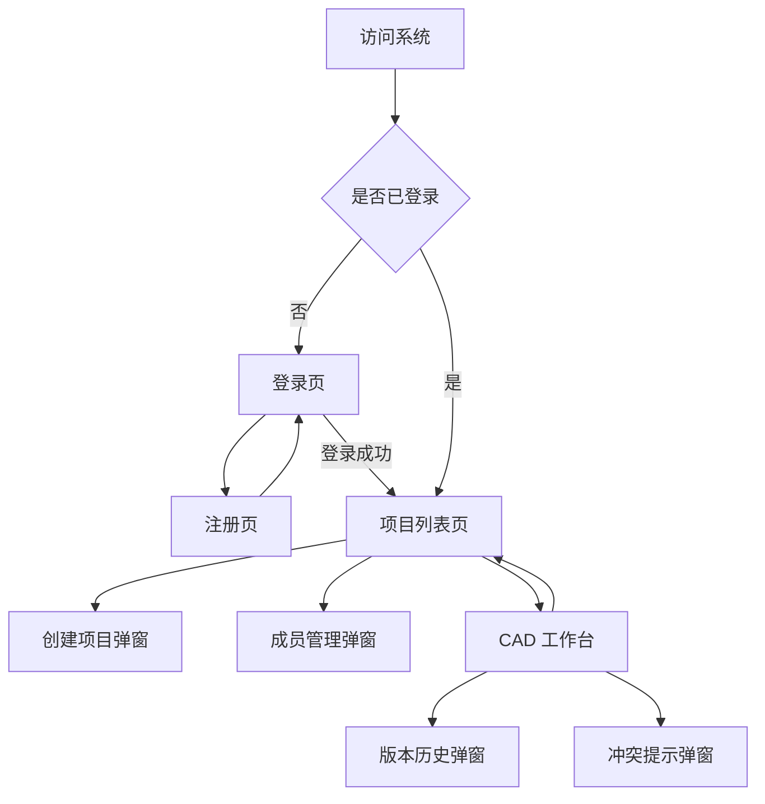

# 基于云的协同机械 CAD 系统原型设计与交互设计文档

## 1. 文档说明

### 1.1 文档目的

本文档是“基于云的协同机械 CAD 系统”的第 09 阶段产物，用于在需求分析、详细设计、数据库设计和接口设计的基础上，明确系统前端页面原型、布局结构、组件职责、交互流程、状态反馈和异常处理方式。

开发人员阅读本文后，应能够明确：

1. 登录、注册、项目列表、CAD 工作台、成员管理、版本历史等页面如何布局。
2. 工具栏、特征树、3D 视图区、属性面板、在线用户区、状态栏如何组织。
3. 草图绘制、约束添加、拉伸、Cut、布尔、保存、Undo/Redo 如何交互。
4. 在线用户、远程光标、冲突提示、WebSocket 断线如何呈现。
5. 前端页面如何绑定 `08-接口设计文档.md` 中的接口。
6. MVP 阶段哪些交互必须实现，哪些交互作为 P1/P2 增强。

### 1.2 设计依据

本文档依据：

1. `02-需求分析文档.md`
2. `03-概要设计文档.md`
3. `06-详细设计文档.md`
4. `08-接口设计文档.md`
5. `02附件-实验最低要求核验与补充设计.md`

### 1.3 原型范围

MVP 原型覆盖：

1. 登录页。
2. 注册页。
3. 项目列表页。
4. 创建项目弹窗。
5. 项目成员管理弹窗。
6. CAD 工作台页。
7. 属性面板。
8. 版本历史弹窗。
9. 冲突提示弹窗。
10. 保存失败和协同断线状态。

P1/P2 原型预留：

1. 椭圆、多段线、构造线。
2. 更细致的尺寸标注。
3. 版本差异对比。
4. 跟随协作者视角。
5. OpenCascade.js 技术验证入口。

### 1.4 设计风格定位

本项目是机械 CAD 协同工具，不是营销展示网站。界面应体现：

1. 工具型。
2. 高信息密度。
3. 清晰边界。
4. 状态可见。
5. 操作路径短。
6. 适合反复编辑和演示。

不建议：

1. 大面积装饰性插画。
2. 营销式 Hero 区域。
3. 过度圆角和大卡片堆叠。
4. 单一蓝紫色渐变风格。
5. 在工作台中放大量说明文字。

## 2. 信息架构

### 2.1 页面结构

```text
未登录
  /login
  /register

已登录
  /projects
  /workspace/:projectId/:documentId
```

### 2.2 页面跳转关系



### 2.3 核心用户路径

MVP 演示主路径：

```text
注册/登录
  -> 创建项目
  -> 进入 CAD 工作台
  -> 绘制矩形
  -> 拉伸成立方体
  -> 保存版本
  -> 添加协作者
  -> 协作者进入同一文档
  -> 绘制圆并 Cut
  -> 实时同步
  -> 查看版本历史
```

### 2.4 角色与可见功能

| 功能 | OWNER | EDITOR | VIEWER |
| --- | --- | --- | --- |
| 查看项目 | 是 | 是 | 是 |
| 创建项目 | 是 | 是 | 是 |
| 修改项目信息 | 是 | 否 | 否 |
| 管理项目成员 | 是 | 否 | 否 |
| 打开 CAD 文档 | 是 | 是 | 是 |
| 绘制草图 | 是 | 是 | 否 |
| 创建 3D 特征 | 是 | 是 | 否 |
| 保存文档 | 是 | 是 | 否 |
| 查看版本历史 | 是 | 是 | 是 |
| 恢复版本 | 是 | 是 | 否 |
| 发送远程光标 | 是 | 是 | 是 |
| 发送建模 operation | 是 | 是 | 否 |

VIEWER 在工作台中应看到禁用状态，而不是完全隐藏所有工具。这样答辩时更容易解释权限差异。

## 3. 全局设计规范

### 3.1 布局规范

本系统采用桌面优先设计。

推荐最小可用宽度：

```text
1280px
```

工作台推荐布局：

```text
顶部工具栏：56px 到 72px
左侧特征树：260px
右侧属性面板：320px
底部状态栏：28px 到 32px
中央视图区：占满剩余空间
```

可调整项：

1. 左侧特征树宽度可拖拽，范围 220px 到 360px。
2. 右侧属性面板宽度可拖拽，范围 280px 到 420px。
3. 中央视图区不能被侧栏完全挤压，最小宽度 520px。

### 3.2 色彩规范

建议色彩：

| 用途 | 颜色建议 | 说明 |
| --- | --- | --- |
| 页面背景 | `#f5f7fa` | 浅灰，减少视觉疲劳 |
| 面板背景 | `#ffffff` | 内容区 |
| 主文本 | `#1f2937` | 深灰 |
| 次文本 | `#6b7280` | 辅助信息 |
| 主操作 | `#2563eb` | 蓝色按钮 |
| 成功 | `#16a34a` | 保存成功、连接正常 |
| 警告 | `#d97706` | 冲突、未保存 |
| 错误 | `#dc2626` | 保存失败、断线 |
| 选中对象 | `#f59e0b` | CAD 选中高亮 |
| 远程用户 | 多色分配 | 每个协作者一个稳定颜色 |

注意：

1. 不使用大面积渐变。
2. 不让界面整体被单一色系支配。
3. CAD 视图区背景建议浅灰或深灰网格，可配置。

### 3.3 字体与字号

推荐：

| 区域 | 字号 |
| --- | --- |
| 页面标题 | 20px 到 24px |
| 工具栏按钮 | 12px |
| 面板标题 | 14px 到 16px |
| 表单标签 | 13px |
| 状态栏 | 12px |
| 特征树节点 | 13px |

原则：

1. 工作台内不使用大标题。
2. 表格和面板以紧凑可读为主。
3. 字体不随视口宽度缩放。
4. 字间距保持默认。

### 3.4 组件规范

建议使用 Element Plus：

| 场景 | 组件 |
| --- | --- |
| 表单 | `ElForm`、`ElInput`、`ElSelect` |
| 按钮 | `ElButton` |
| 弹窗 | `ElDialog` |
| 表格 | `ElTable` |
| 标签 | `ElTag` |
| 提示 | `ElMessage`、`ElNotification` |
| 树 | `ElTree` 或自定义 Tree |
| Tabs | `ElTabs` |
| 下拉菜单 | `ElDropdown` |

按钮规范：

1. 工具栏优先使用图标按钮。
2. 重要命令使用图标 + 短文本。
3. 图标按钮必须有 tooltip。
4. 删除、恢复版本等危险操作需要确认。

图标建议：

1. 使用 Element Plus icons 或 lucide 图标。
2. 不手写复杂 SVG 图标。
3. 工具类图标应保持线性风格一致。

### 3.5 全局状态反馈

所有页面都应支持：

1. 加载中。
2. 空状态。
3. 错误状态。
4. 权限不足状态。
5. 网络异常状态。

状态展示原则：

1. 加载中使用局部 loading，不遮挡整个工作台过久。
2. 错误提示放在操作附近，同时记录到状态栏。
3. 工作台协同断线时不弹出阻塞弹窗，优先在状态栏提示。
4. 保存失败必须明显提示，不清除未保存状态。

## 4. 登录页原型

### 4.1 页面目标

登录页用于用户输入账号密码，获取 JWT 并进入项目列表页。

### 4.2 布局原型

```text
+------------------------------------------------------+
|                                                      |
|                 Cloud CAD 协同机械设计                |
|                                                      |
|              +--------------------------+            |
|              | 用户名 / 邮箱             |            |
|              +--------------------------+            |
|              | 密码                      |            |
|              +--------------------------+            |
|              | [ 登录 ]                  |            |
|              | 没有账号？注册             |            |
|              +--------------------------+            |
|                                                      |
+------------------------------------------------------+
```

### 4.3 组件清单

| 组件 | 说明 |
| --- | --- |
| 系统名称 | 显示产品名称 |
| 登录表单 | 用户名、密码 |
| 登录按钮 | 调用登录接口 |
| 注册入口 | 跳转注册页 |
| 错误提示 | 显示登录失败原因 |

### 4.4 交互流程

```text
输入用户名和密码
  -> 点击登录
  -> 表单校验
  -> 调用 POST /api/auth/login
  -> 保存 token
  -> 调用 GET /api/auth/me 或直接写入 user
  -> 跳转 /projects
```

### 4.5 表单校验

| 字段 | 校验 |
| --- | --- |
| username | 必填 |
| password | 必填，至少 6 位 |

### 4.6 异常状态

| 场景 | 展示 |
| --- | --- |
| 用户名或密码错误 | 表单下方显示错误 |
| 网络失败 | 顶部或按钮附近显示“无法连接服务器” |
| token 已过期跳回登录 | 显示“登录已过期，请重新登录” |

## 5. 注册页原型

### 5.1 页面目标

注册页用于创建新账号，注册成功后自动登录或跳转登录页。

### 5.2 布局原型

```text
+------------------------------------------------------+
|                 创建 Cloud CAD 账号                   |
|                                                      |
|              +--------------------------+            |
|              | 用户名                    |            |
|              +--------------------------+            |
|              | 邮箱                      |            |
|              +--------------------------+            |
|              | 密码                      |            |
|              +--------------------------+            |
|              | 确认密码                  |            |
|              +--------------------------+            |
|              | [ 注册 ]                  |            |
|              | 已有账号？登录             |            |
|              +--------------------------+            |
+------------------------------------------------------+
```

### 5.3 交互流程

```text
输入注册信息
  -> 本地校验
  -> 调用 POST /api/auth/register
  -> 注册成功保存 token
  -> 跳转 /projects
```

### 5.4 异常状态

| 场景 | 展示 |
| --- | --- |
| 用户名已存在 | username 输入框下方提示 |
| 邮箱已存在 | email 输入框下方提示 |
| 两次密码不一致 | confirm password 下方提示 |
| 注册成功 | 跳转项目列表 |

## 6. 项目列表页原型

### 6.1 页面目标

项目列表页用于展示当前用户可访问的项目，并提供创建项目、进入项目、管理成员的入口。

### 6.2 布局原型

```text
+--------------------------------------------------------------------------------+
| Cloud CAD                                                Alice  [退出]           |
+--------------------------------------------------------------------------------+
| 项目                                                                             |
| [ + 新建项目 ]                                                                   |
|                                                                                |
| +------------------------------+  +------------------------------+              |
| | 机械零件协同设计              |  | 课程实验 Demo                |              |
| | 角色：OWNER                   |  | 角色：EDITOR                 |              |
| | 更新时间：2026-06-17          |  | 更新时间：2026-06-17          |              |
| | [进入工作台] [成员] [更多]     |  | [进入工作台]                 |              |
| +------------------------------+  +------------------------------+              |
|                                                                                |
+--------------------------------------------------------------------------------+
```

### 6.3 组件清单

| 组件 | 说明 |
| --- | --- |
| 顶部栏 | 系统名称、当前用户、退出 |
| 新建项目按钮 | 打开创建项目弹窗 |
| 项目列表 | 展示用户有权限的项目 |
| 项目项 | 名称、描述、角色、更新时间、入口 |
| 成员按钮 | OWNER 可见 |
| 空状态 | 没有项目时显示创建入口 |

### 6.4 项目项显示字段

| 字段 | 来源 |
| --- | --- |
| 项目名称 | `ProjectDTO.name` |
| 描述 | `ProjectDTO.description` |
| 我的角色 | `ProjectDTO.myRole` |
| 更新时间 | `ProjectDTO.updatedAt` |
| 默认文档 id | `ProjectDTO.defaultDocumentId` |

### 6.5 交互流程

进入项目：

```text
点击项目的“进入工作台”
  -> 若 defaultDocumentId 存在
  -> 跳转 /workspace/:projectId/:documentId
```

退出登录：

```text
点击退出
  -> 清除 token
  -> 清除用户状态
  -> 跳转 /login
```

### 6.6 空状态

没有项目时显示：

```text
暂无项目
[新建项目]
```

不要展示大段说明文字。

## 7. 创建项目弹窗

### 7.1 弹窗目标

创建项目并自动生成默认 CAD 文档。

### 7.2 布局原型

```text
+--------------------------------------+
| 新建项目                              |
| 项目名称  [                    ]      |
| 项目描述  [                    ]      |
|                                      |
|                    [取消] [创建]      |
+--------------------------------------+
```

### 7.3 交互流程

```text
点击新建项目
  -> 打开弹窗
  -> 输入名称和描述
  -> 点击创建
  -> POST /api/projects
  -> 成功后关闭弹窗
  -> 刷新项目列表
  -> 可选择直接进入工作台
```

MVP 建议：

1. 创建成功后留在项目列表并新增项目项。
2. 项目项中提供进入工作台按钮。

### 7.4 校验

| 字段 | 校验 |
| --- | --- |
| name | 必填，1 到 128 字符 |
| description | 可选 |

## 8. 项目成员管理弹窗

### 8.1 弹窗目标

OWNER 用于查看成员、添加成员、修改角色和移除成员。

### 8.2 布局原型

```text
+----------------------------------------------------------------+
| 项目成员                                                        |
| 添加成员： [邮箱                         ] [角色 v] [添加]       |
|                                                                |
| +------------------------------------------------------------+ |
| | 用户             | 邮箱              | 角色       | 操作       | |
| | Alice            | alice@example.com | OWNER      | -          | |
| | Bob              | bob@example.com   | EDITOR     | 修改/移除  | |
| +------------------------------------------------------------+ |
|                                                  [关闭]        |
+----------------------------------------------------------------+
```

### 8.3 角色选择

MVP 可选角色：

1. `EDITOR`
2. `VIEWER`

不建议通过添加成员入口新增 OWNER。

### 8.4 交互流程

添加成员：

```text
输入邮箱
  -> 选择角色
  -> 点击添加
  -> POST /api/projects/{projectId}/members
  -> 成功后刷新成员表格
```

修改角色：

```text
选择成员角色
  -> PATCH /api/projects/{projectId}/members/{memberId}/role
  -> 成功后刷新行数据
```

移除成员：

```text
点击移除
  -> 二次确认
  -> DELETE /api/projects/{projectId}/members/{memberId}
  -> 成功后移除行
```

### 8.5 异常状态

| 场景 | 展示 |
| --- | --- |
| 用户不存在 | 邮箱输入框下方提示 |
| 成员已存在 | 表格上方显示错误 |
| 无 OWNER 权限 | 禁用添加和修改入口 |
| 试图移除唯一 OWNER | 禁止操作并提示 |

## 9. CAD 工作台总体原型

### 9.1 页面目标

CAD 工作台是系统核心页面，用于完成草图绘制、3D 建模、参数编辑、协同同步、版本保存和版本恢复。

### 9.2 总体布局

```text
+------------------------------------------------------------------------------------------------+
| 顶部菜单/工具栏：选择 线段 矩形 圆 | 固定 水平 垂直 尺寸 | 立方体 球体 锥体 拉伸 Cut Union Difference | 保存 版本 |
+----------------------------+------------------------------------------------+------------------+
| 左侧特征树                 | 中央 3D 视图区                                  | 右侧属性面板     |
| Document                   |                                                | 选中对象          |
|  Sketches                  |            Three.js Viewport                   | 参数输入          |
|    Sketch 1                |            网格 / 坐标轴 / 模型                 | 约束              |
|      Rect 1                |            远程光标 Overlay                    | 操作按钮          |
|  Features                  |                                                |                  |
|    Box 1                   |                                                |                  |
|    Sphere 1                |                                                |                  |
|    Cone 1                  |                                                |                  |
|    Extrude 1               |                                                | 在线用户          |
+----------------------------+------------------------------------------------+------------------+
| 状态栏：API 正常 | WebSocket 已连接 | 已保存/未保存 | 在线 2 人 | 最近消息                  |
+------------------------------------------------------------------------------------------------+
```

### 9.3 区域尺寸

| 区域 | 建议尺寸 |
| --- | --- |
| 顶部工具栏 | 64px |
| 左侧特征树 | 260px |
| 右侧属性面板 | 320px |
| 状态栏 | 30px |
| 中央视图区 | 剩余空间 |

### 9.4 工作台组件层级

```text
WorkspacePage
  WorkspaceHeader
  CadToolbar
  WorkspaceBody
    FeatureTree
    CadViewport
      ViewportOverlay
      RemoteCursorLayer
      SelectionOverlay
    RightPanel
      PropertyPanel
      OnlineUsers
  StatusBar
  VersionHistoryDialog
  ConflictNoticeDialog
```

### 9.5 工作台加载流程

```text
进入工作台路由
  -> GET /api/projects/{projectId}
  -> GET /api/documents/{documentId}
  -> 初始化 CadDocument
  -> 初始化 SceneManager
  -> 连接 WebSocket /ws
  -> 订阅 presence/cursor/operations/system
  -> SEND join
  -> 状态栏显示连接状态
```

### 9.6 工作台权限状态

| 角色 | 工具栏状态 | 属性面板 | 保存 |
| --- | --- | --- | --- |
| OWNER | 可用 | 可编辑 | 可用 |
| EDITOR | 可用 | 可编辑 | 可用 |
| VIEWER | 建模工具禁用 | 只读 | 禁用 |

VIEWER 禁用按钮应保留 tooltip：

```text
只读权限，无法编辑
```

## 10. 顶部工具栏交互设计

### 10.1 工具栏分组

```text
选择 | 草图 | 约束 | 特征 | 历史 | 视图 | 文档
```

### 10.2 MVP 工具清单

| 分组 | 工具 | 类型 | 状态 |
| --- | --- | --- | --- |
| 选择 | Select | 图标按钮 | P0 |
| 草图 | Line | 图标按钮 | P0 |
| 草图 | Rectangle | 图标按钮 | P0 |
| 草图 | Circle | 图标按钮 | P0 |
| 约束 | Fixed | 图标按钮 | P0 |
| 约束 | Horizontal | 图标按钮 | P0 |
| 约束 | Vertical | 图标按钮 | P0 |
| 约束 | Dimension | 图标按钮 | P0 |
| 特征 | Extrude | 图标 + 文本按钮 | P0 |
| 特征 | Cut | 图标 + 文本按钮 | P0 |
| 特征 | Union | 图标 + 文本按钮 | P0 |
| 特征 | Difference | 图标 + 文本按钮 | P0 |
| 特征 | Box | 图标 + 文本按钮 | P0 |
| 特征 | Sphere | 图标 + 文本按钮 | P0 |
| 特征 | Cone | 图标 + 文本按钮 | P0 |
| 历史 | Undo | 图标按钮 | P0 |
| 历史 | Redo | 图标按钮 | P0 |
| 文档 | Save | 图标 + 文本按钮 | P0 |
| 文档 | Versions | 图标 + 文本按钮 | P0 |

P1 工具：

1. Ellipse。
2. Polyline。
3. Construction Line。
4. Grid Snap。
5. Export JSON。

### 10.3 工具状态

工具按钮状态：

| 状态 | 展示 |
| --- | --- |
| normal | 默认 |
| hover | 背景加深 |
| active | 主色边框或浅色背景 |
| disabled | 降低透明度，不可点击 |
| loading | 保存等异步操作显示 loading |

### 10.4 工具切换交互

```text
点击工具按钮
  -> cadStore.setActiveTool(tool)
  -> 工具按钮 active
  -> 视图区鼠标样式变化
  -> 状态栏显示当前工具
```

规则：

1. 绘图工具互斥。
2. 约束工具执行一次后可回到选择工具。
3. 保存、版本、Undo、Redo 是命令按钮，不改变 activeTool。
4. 切换工具时清除 preview。

## 11. 左侧特征树交互设计

### 11.1 特征树目标

特征树用于展示 CAD 文档结构、草图实体和建模历史。

### 11.2 树结构原型

```text
Document: Demo Part
  Sketches
    Sketch 1
      Line 1
      Rectangle 1
      Circle 1
  Constraints
    Horizontal 1
    Dimension 1
  Features
    Box 1
    Sphere 1
    Cone 1
    Extrude 1
    Cut 1
    Boolean Union 1
```

### 11.3 节点交互

| 操作 | 结果 |
| --- | --- |
| 单击节点 | 选中对象，视图区高亮 |
| 双击节点 | P1 重命名 |
| 右键节点 | 打开上下文菜单 |
| 点击可见性图标 | 隐藏/显示对象 |
| Delete | 删除选中对象 |

MVP 右键菜单：

1. 选中。
2. 删除。
3. 定位到对象。

P1 右键菜单：

1. 重命名。
2. 抑制特征。
3. 展开依赖。

### 11.4 删除交互

```text
选中特征树节点
  -> 点击删除或按 Delete
  -> 若对象无依赖，直接删除
  -> 若对象被特征引用，弹出提示
```

依赖提示：

```text
该草图实体正在被 Extrude 1 使用，请先删除相关特征。
```

### 11.5 与视图区同步

1. 特征树选中对象，视图区对象高亮。
2. 视图区选中对象，特征树同步选中。
3. 远程 operation 修改对象，树节点自动刷新。
4. 删除对象后，属性面板清空或显示文档属性。

## 12. 中央视图区交互设计

### 12.1 视图区目标

视图区用于显示草图、三维模型、网格、坐标轴、选中高亮和远程光标。

### 12.2 基础视觉元素

| 元素 | MVP |
| --- | --- |
| XY 网格 | 是 |
| 坐标轴 | 是 |
| 3D 模型 | 是 |
| 草图线框 | 是 |
| 选中高亮 | 是 |
| 远程光标 | 是 |
| 尺寸标注 | P1 |

### 12.3 鼠标交互

| 操作 | 行为 |
| --- | --- |
| 左键单击 | 选择对象或开始绘制 |
| 左键拖拽 | 绘制矩形、圆、线段 preview |
| 鼠标移动 | 更新 preview 或发送远程光标 |
| 滚轮 | 缩放 |
| 中键拖拽 | 平移 |
| 右键拖拽 | 旋转视角，若 OrbitControls 支持 |

### 12.4 选择交互

```text
Select 工具激活
  -> 点击模型或草图
  -> SceneManager.pick
  -> cadStore.selection 更新
  -> 对象高亮
  -> FeatureTree 同步选中
  -> PropertyPanel 展示参数
```

未选中任何对象：

1. 属性面板显示文档信息。
2. 特征树取消选中。
3. 工具栏仍保持当前工具。

### 12.5 视图控制

工具栏提供：

1. 适应窗口。
2. 重置视角。
3. 显示/隐藏网格。

P1 可增加：

1. 正视图。
2. 俯视图。
3. 右视图。
4. 等轴测。

### 12.6 空视图区

新文档打开后显示：

1. 网格。
2. 坐标轴。
3. 空 Sketch 1。

不要在视图区显示大段教学说明，避免遮挡工作区域。

## 13. 草图绘制交互设计

### 13.1 绘制线段

流程：

```text
点击 Line 工具
  -> pointerDown 确定起点
  -> pointerMove 显示临时线段
  -> pointerUp 确定终点
  -> 创建 LineEntity
  -> 特征树新增 Line
  -> 属性面板显示线段参数
  -> 发送 operation
```

状态反馈：

1. 绘制中线段使用虚线或浅色。
2. 完成后使用普通草图线。
3. 选中时使用高亮色。

校验：

1. 起点和终点不能相同。
2. 长度过短时取消创建。

### 13.2 绘制矩形

流程：

```text
点击 Rectangle 工具
  -> pointerDown 确定起点
  -> pointerMove 显示矩形 preview
  -> pointerUp 创建 RectangleEntity
  -> 属性面板显示 width/height
  -> 发送 operation
```

属性：

1. origin.x。
2. origin.y。
3. width。
4. height。

### 13.3 绘制圆

流程：

```text
点击 Circle 工具
  -> pointerDown 确定圆心
  -> pointerMove 显示半径 preview
  -> pointerUp 创建 CircleEntity
  -> 属性面板显示 center/radius
  -> 发送 operation
```

属性：

1. center.x。
2. center.y。
3. radius。

### 13.4 草图绘制失败

| 场景 | 处理 |
| --- | --- |
| 拖拽距离太短 | 不创建实体 |
| 当前用户是 VIEWER | 工具不可用 |
| WebSocket 断开 | 本地仍可编辑，但状态栏提示协同断开 |
| operation 发送失败 | 保留本地修改，提示同步失败 |

## 14. 约束与尺寸交互设计

### 14.1 固定约束

流程：

```text
选中草图实体
  -> 点击 Fixed
  -> 添加 fixed constraint
  -> 属性面板标记为锁定
  -> 实体不可拖动或编辑坐标
```

展示：

1. 特征树 Constraints 下新增 Fixed。
2. 选中对象属性面板显示“锁定”状态。

### 14.2 水平约束

适用对象：

```text
LineEntity
```

流程：

```text
选中线段
  -> 点击 Horizontal
  -> 将 start.y 和 end.y 调整一致
  -> 添加 horizontal constraint
```

### 14.3 垂直约束

适用对象：

```text
LineEntity
```

流程：

```text
选中线段
  -> 点击 Vertical
  -> 将 start.x 和 end.x 调整一致
  -> 添加 vertical constraint
```

### 14.4 尺寸驱动

流程：

```text
选中矩形/圆/线段
  -> 属性面板输入尺寸
  -> 校验数值
  -> 更新实体参数
  -> 重建几何
  -> 发送 operation
```

参数规则：

| 对象 | 可编辑尺寸 |
| --- | --- |
| 矩形 | width、height |
| 圆 | radius |
| 线段 | length，P1 |

### 14.5 重合约束，P1

流程：

```text
选择两个端点
  -> 点击 Coincident
  -> 两端点坐标同步
  -> 添加 coincident constraint
```

MVP 可只预留按钮或不显示。

## 15. 3D 特征建模交互设计

### 15.0 参数化三维基础体

入口：

```text
工具栏 立方体 / 球体 / 锥体
```

流程：

```text
点击基础体按钮
  -> 打开参数弹窗
  -> 输入长宽高、半径或底面半径/高度
  -> 点击创建
  -> 创建 box / sphere / cone feature
  -> 视图区渲染三维实体
  -> 特征树新增对应实体
  -> 属性面板显示坐标和尺寸参数
  -> 发送 feature.created operation
```

编辑：

1. 在视图区点击基础体，实体高亮并同步选中特征树节点。
2. 拖拽基础体主体，可在 XY 平面内移动实体位置。
3. 在右侧属性面板修改 X、Y、Z、长度、宽度、高度、半径、底面半径等参数。
4. 参数修改后立即重建 Three.js mesh，并进入 Undo/Redo 与协同同步流程。

异常：

1. 长度、宽度、高度、半径和底面半径必须大于 0。
2. VIEWER 角色禁用基础体创建、拖拽和属性编辑。

### 15.1 拉伸

入口：

```text
工具栏 Extrude
```

流程：

```text
选中矩形或圆
  -> 点击 Extrude
  -> 属性面板显示拉伸参数
  -> 输入 depth
  -> 点击应用
  -> 创建 ExtrudeFeature
  -> 视图区生成 3D 模型
  -> 特征树新增 Extrude
  -> 发送 operation
```

参数：

| 字段 | 默认值 |
| --- | --- |
| depth | 30 |
| operation | new |

异常：

1. 未选中可拉伸草图时，点击 Extrude 显示提示。
2. depth 小于等于 0 时禁止应用。

### 15.2 Cut 切除

入口：

```text
工具栏 Cut
```

推荐 MVP 流程：

```text
选中目标特征
  -> 点击 Cut
  -> 选择切除草图实体
  -> 输入 depth
  -> 点击应用
  -> 创建 CutFeature
  -> 使用 CSG 做差集
  -> 特征树新增 Cut
  -> 发送 operation
```

简化方案：

1. 属性面板提供 targetFeature 下拉。
2. 提供 toolSketch/toolEntity 下拉。
3. 用户选择后点击应用。

### 15.3 布尔并集

流程：

```text
选择 targetFeature
  -> 点击 Union
  -> 选择 toolFeature
  -> 点击应用
  -> 创建 BooleanFeature(operation = union)
  -> 视图区更新
```

### 15.4 布尔差集

流程：

```text
选择 targetFeature
  -> 点击 Difference
  -> 选择 toolFeature
  -> 点击应用
  -> 创建 BooleanFeature(operation = difference)
  -> 视图区更新
```

### 15.5 CSG 失败反馈

如果 three-bvh-csg 计算失败：

1. 不写入特征树。
2. 不修改文档状态。
3. 显示提示：

```text
布尔运算失败，请检查实体是否封闭或调整参数。
```

## 16. 右侧属性面板设计

### 16.1 属性面板状态

属性面板根据 selection 切换：

| selection | 显示 |
| --- | --- |
| none | 文档信息 |
| sketch | 草图信息 |
| sketch-entity | 草图实体参数 |
| feature | 特征参数 |
| constraint | 约束参数，P1 |

### 16.2 文档信息面板

显示：

1. 文档名称。
2. 当前版本。
3. 单位。
4. 保存状态。

操作：

1. 保存。
2. 查看版本。
3. 导出 JSON，P1。

### 16.3 草图实体属性

矩形：

```text
名称
origin.x
origin.y
width
height
visible
locked
```

圆：

```text
名称
center.x
center.y
radius
visible
locked
```

线段：

```text
名称
start.x
start.y
end.x
end.y
visible
locked
```

### 16.4 特征属性

拉伸：

```text
名称
sourceSketch
sourceEntity
depth
suppressed
```

Cut：

```text
名称
targetFeature
toolSketch
toolEntity
depth
suppressed
```

Boolean：

```text
名称
operation
targetFeature
toolFeature
suppressed
```

参数化基础体：

```text
名称
suppressed
position.x
position.y
position.z
length / width / height
radius
baseRadius / height
```

### 16.5 参数编辑交互

```text
用户修改输入框
  -> blur 或 Enter 提交
  -> 校验
  -> executeCommand
  -> rebuildGeometry
  -> sendOperation
```

不建议每输入一个字符就重建模型。数字输入可以在失焦或按 Enter 时提交。

### 16.6 只读状态

VIEWER：

1. 所有输入框 disabled。
2. 建模操作按钮 disabled。
3. 可查看参数。
4. 状态栏显示只读角色。

## 17. 在线用户与协同交互设计

### 17.1 在线用户区

右侧面板或工具栏右侧展示：

```text
在线：Alice OWNER  Bob EDITOR
```

建议用小头像圆点 + 名称：

1. 每个用户一个稳定颜色。
2. OWNER、EDITOR、VIEWER 使用 `ElTag` 展示。
3. 当前用户标记“我”。

### 17.2 远程光标

显示规则：

1. 远程光标显示在 3D 视图区 overlay。
2. 光标旁显示用户名。
3. 不显示当前用户自己的光标。
4. 超过 5 秒未更新逐渐淡出。

光标样式：

```text
小箭头或十字光标 + 用户名标签
```

### 17.3 Operation 同步反馈

当收到远程 operation：

1. 视图区更新。
2. 特征树更新。
3. 若远程修改当前选中对象，属性面板刷新。
4. 状态栏显示“已同步 Bob 的操作”。

不要对每个远程 operation 弹窗，避免打断编辑。

### 17.4 协同断线

状态栏显示：

```text
WebSocket 断开，正在重连
```

重连失败：

```text
协同连接不可用，本地编辑不会同步
```

行为：

1. 本地编辑可以继续。
2. 保存仍可通过 REST 进行。
3. 远程光标和在线用户停止更新。
4. 重连成功后重新 join document。

## 18. 冲突提示设计

### 18.1 触发场景

1. 保存时 `baseVersion` 落后。
2. WebSocket 收到 `conflict.warning`。
3. 远程 operation 修改了当前用户正在编辑的同一对象。

### 18.2 非阻塞提示

轻微冲突使用通知：

```text
检测到 Bob 修改了当前对象，请检查参数。
```

### 18.3 阻塞弹窗

保存版本冲突使用弹窗：

```text
文档版本已更新

服务器版本：4
你的基准版本：3

[刷新文档] [取消]
```

MVP 不提供自动合并。

### 18.4 冲突弹窗操作

| 操作 | 结果 |
| --- | --- |
| 刷新文档 | 重新 GET 文档，清空本地 Undo/Redo |
| 取消 | 保留本地状态，但保存仍可能失败 |

### 18.5 冲突展示位置

1. 状态栏显示最近冲突。
2. 对象被冲突修改时，属性面板顶部显示警告。
3. 严重冲突才弹窗。

## 19. 版本历史弹窗

### 19.1 弹窗目标

显示文档历史版本，并允许 OWNER/EDITOR 恢复版本。

### 19.2 布局原型

```text
+----------------------------------------------------------------+
| 版本历史                                                        |
| +------------------------------------------------------------+ |
| | 版本 | 保存人 | 保存时间              | 备注        | 操作    | |
| | v4   | Alice  | 2026-06-17 12:00     | 新增 Cut    | 查看/恢复| |
| | v3   | Bob    | 2026-06-17 11:30     | 拉伸        | 查看/恢复| |
| +------------------------------------------------------------+ |
|                                                   [关闭]       |
+----------------------------------------------------------------+
```

### 19.3 交互流程

打开：

```text
点击工具栏 Versions
  -> GET /api/documents/{documentId}/versions
  -> 展示版本列表
```

查看版本：

```text
点击查看
  -> GET /api/documents/{documentId}/versions/{versionId}
  -> P1 可显示快照预览
```

恢复版本：

```text
点击恢复
  -> 二次确认
  -> POST /api/documents/{documentId}/versions/{versionId}/restore
  -> 替换当前 CadDocument
  -> 清空 Undo/Redo
  -> rebuildGeometry
  -> 广播 version.restored
```

### 19.4 权限

| 角色 | 查看 | 恢复 |
| --- | --- | --- |
| OWNER | 是 | 是 |
| EDITOR | 是 | 是 |
| VIEWER | 是 | 否 |

VIEWER 恢复按钮禁用。

## 20. 状态栏设计

### 20.1 状态栏内容

```text
API: 正常 | WebSocket: 已连接 | 保存: 已保存 | 在线: 2 | 工具: Rectangle | 版本: v4
```

### 20.2 状态项

| 状态项 | 来源 |
| --- | --- |
| API 连接 | `/actuator/health` 或 API 调用结果 |
| WebSocket | `statusStore.websocketStatus` |
| 保存状态 | `statusStore.saveStatus` |
| 在线人数 | `collaborationStore.onlineUsers.length` |
| 当前工具 | `cadStore.activeTool` |
| 当前版本 | `cadStore.currentVersion` |
| 最近错误 | `statusStore.lastError` |

### 20.3 状态颜色

| 状态 | 颜色 |
| --- | --- |
| 正常 | 绿色 |
| 未保存 | 橙色 |
| 保存中 | 蓝色 |
| 失败 | 红色 |
| 断开 | 红色 |
| 重连中 | 橙色 |

### 20.4 保存状态变化

```text
初始加载 -> saved
本地 command -> dirty
点击保存 -> saving
保存成功 -> saved
保存失败 -> failed
再次修改 -> dirty
```

## 21. 加载、空状态与错误状态

### 21.1 页面加载

| 页面 | 加载状态 |
| --- | --- |
| 登录页 | 按钮 loading |
| 项目列表 | 列表区域 loading |
| 工作台 | 中央视图区显示轻量 loading |
| 版本弹窗 | 表格 loading |
| 成员弹窗 | 表格 loading |

### 21.2 空状态

| 场景 | 文案 |
| --- | --- |
| 无项目 | 暂无项目 |
| 无版本 | 暂无历史版本 |
| 无成员 | 暂无成员 |
| 空文档 | 只显示网格和默认 Sketch |

### 21.3 错误状态

| 场景 | 处理 |
| --- | --- |
| 401 | 跳转登录 |
| 403 | 显示无权限，并返回项目列表 |
| 404 | 显示资源不存在 |
| 409 | 显示冲突提示 |
| 500 | 显示系统错误 |

## 22. 响应式设计

### 22.1 桌面端

MVP 主要支持桌面端：

```text
1280px 及以上
```

原因：

1. CAD 工作台需要大视图区。
2. 工具栏、特征树、属性面板同时展示更高效。
3. 课程演示通常在电脑端进行。

### 22.2 平板端

平板端可做简化：

1. 左侧特征树可折叠。
2. 右侧属性面板可抽屉显示。
3. 工具栏允许换行或分组下拉。

### 22.3 手机端

MVP 不建议支持完整 CAD 编辑。

手机端可显示提示：

```text
当前屏幕不适合 CAD 编辑，请使用桌面浏览器打开。
```

也可以只允许：

1. 查看项目列表。
2. 查看文档基本信息。
3. 不允许建模编辑。

## 23. 可访问性与可用性

### 23.1 键盘可用性

建议支持：

| 按键 | 行为 |
| --- | --- |
| Delete | 删除选中对象 |
| Esc | 取消当前绘制或关闭 preview |
| Enter | 提交属性输入 |
| Ctrl+S | 保存 |
| Ctrl+Z | Undo |
| Ctrl+Y | Redo |

注意：快捷键说明可以放到帮助文档或 tooltip 中，不在工作台主界面大段展示。

### 23.2 焦点管理

1. 弹窗打开后焦点进入第一个输入框。
2. 弹窗关闭后焦点回到触发按钮。
3. 属性面板输入时不触发视图区快捷键。
4. Esc 优先关闭弹窗，其次取消绘图。

### 23.3 可读性

1. 文本和背景保持足够对比度。
2. 错误提示不能只依赖颜色。
3. 图标按钮需要 tooltip。
4. 禁用按钮需要说明原因。

## 24. 与接口的绑定关系

### 24.1 登录页

| 操作 | 接口 |
| --- | --- |
| 登录 | `POST /api/auth/login` |
| 查询当前用户 | `GET /api/auth/me` |

### 24.2 注册页

| 操作 | 接口 |
| --- | --- |
| 注册 | `POST /api/auth/register` |

### 24.3 项目列表页

| 操作 | 接口 |
| --- | --- |
| 加载项目 | `GET /api/projects` |
| 创建项目 | `POST /api/projects` |
| 查询成员 | `GET /api/projects/{projectId}/members` |
| 添加成员 | `POST /api/projects/{projectId}/members` |
| 修改角色 | `PATCH /api/projects/{projectId}/members/{memberId}/role` |
| 移除成员 | `DELETE /api/projects/{projectId}/members/{memberId}` |

### 24.4 CAD 工作台

| 操作 | 接口 |
| --- | --- |
| 加载项目 | `GET /api/projects/{projectId}` |
| 加载文档 | `GET /api/documents/{documentId}` |
| 保存文档 | `PUT /api/documents/{documentId}/save` |
| 导出 JSON | `GET /api/documents/{documentId}/export-json` |
| WebSocket 连接 | `/ws` |
| 加入协同房间 | `/app/documents/{documentId}/join` |
| 发送光标 | `/app/documents/{documentId}/cursor` |
| 发送 operation | `/app/documents/{documentId}/operations` |

### 24.5 版本历史

| 操作 | 接口 |
| --- | --- |
| 版本列表 | `GET /api/documents/{documentId}/versions` |
| 版本详情 | `GET /api/documents/{documentId}/versions/{versionId}` |
| 恢复版本 | `POST /api/documents/{documentId}/versions/{versionId}/restore` |

## 25. 原型验收清单

### 25.1 P0 页面验收

必须满足：

1. 登录页可登录并跳转项目列表。
2. 注册页可创建账号。
3. 项目列表可创建项目。
4. OWNER 可管理项目成员。
5. 点击项目可进入 CAD 工作台。
6. 工作台具备顶部工具栏、左侧特征树、中央视图区、右侧属性面板、在线用户、底部状态栏。
7. 可绘制线段、矩形、圆。
8. 可添加固定、水平、垂直、尺寸约束。
9. 可执行拉伸、Cut、布尔并集、布尔差集。
10. 可通过参数创建立方体/长方体、球体、锥体，并支持视图旋转、拖拽移动和属性面板尺寸编辑。
11. 可保存文档并查看版本列表。
12. 可恢复历史版本。
13. 两个浏览器可看到在线用户、远程光标和操作同步。
14. 同一对象并发修改有冲突提示。
15. VIEWER 无法编辑。

### 25.2 P1 页面验收

建议实现：

1. 椭圆、多段线、构造线。
2. 网格吸附开关。
3. 更清晰的尺寸标注。
4. 导出 JSON。
5. 可折叠侧栏。
6. 版本详情预览。

### 25.3 视觉验收

必须满足：

1. 工作台元素不重叠。
2. 工具栏按钮文字不溢出。
3. 状态栏信息不遮挡视图区。
4. 属性面板输入项对齐。
5. 特征树长名称可省略显示并有 tooltip。
6. 远程光标不影响本地选择。
7. 弹窗在 1280px 宽度下完整显示。

## 26. 前端实现顺序

建议顺序：

1. 实现登录页和注册页。
2. 实现项目列表页。
3. 实现创建项目弹窗。
4. 实现成员管理弹窗。
5. 实现工作台静态布局。
6. 实现工具栏状态。
7. 实现特征树静态结构。
8. 实现 Three.js 视图区和网格。
9. 实现属性面板。
10. 实现线段、矩形、圆绘制。
11. 实现参数化立方体、球体、锥体。
12. 实现三维基础体视口拖拽和属性面板参数编辑。
13. 实现拉伸、Cut、布尔。
14. 实现保存和版本历史。
15. 实现 WebSocket 在线用户。
16. 实现远程光标。
17. 实现 operation 同步。
18. 实现冲突提示和断线状态。

## 27. 原型设计结论

本原型设计将系统界面划分为：

```text
认证页面
项目管理页面
CAD 工作台
成员管理弹窗
版本历史弹窗
协同状态与冲突提示
```

核心交互主线是：

```text
用户进入项目
  -> 打开 CAD 工作台
  -> 使用工具栏创建草图和特征
  -> 通过属性面板修改参数
  -> 特征树记录历史
  -> 视图区实时重建模型
  -> WebSocket 同步协作者
  -> 保存生成版本
```

该原型能够满足实验任务书中对前端界面、基础绘图、3D 建模、协同感知和版本管理的要求，也能为后续 Vue 组件开发提供清晰的页面和交互依据。

下一阶段应进入编码实现前的最终准备：根据 `06`、`07`、`08`、`09` 四份文档拆分前后端开发任务，并开始搭建 Vue + Spring Boot 工程骨架。
