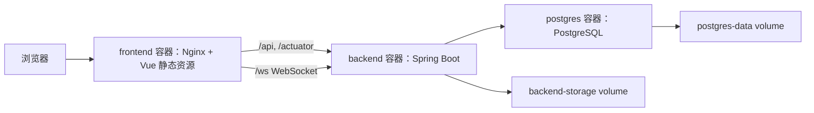

# 16-Docker部署与服务器持续更新方案

## 1. 目标

本方案用于把当前 Cloud CAD 项目部署到云服务器，并支持后续持续更新：

1. 本地继续用现有 `scripts/dev` 脚本开发和调试。
2. GitHub 仓库作为服务器代码来源。
3. 服务器使用 Docker Compose 统一运行 PostgreSQL、Spring Boot 后端、Vue/Nginx 前端。
4. 每次本地修改完成后，按“本地提交 -> 推送 GitHub -> 服务器拉取 -> 重新构建容器”的流程更新。
5. PostgreSQL 数据和后端本地存储使用 Docker volume 持久化，重新构建镜像不会删除业务数据。

## 2. 部署架构



对公网只暴露前端 Nginx 的 `80` 端口。后端 `8080` 和数据库 `5432` 只在 Docker 内部网络中访问，不直接暴露给公网。

## 3. 新增部署文件

| 文件 | 作用 |
| --- | --- |
| `docker-compose.yml` | 生产部署编排，定义 postgres、backend、frontend 三个服务。 |
| `.env.example` | 服务器环境变量模板，不提交真实密码。 |
| `.dockerignore` | 排除 `.git`、`.env`、`.pem`、`node_modules`、构建产物等内容，避免进入镜像构建上下文。 |
| `backend/Dockerfile` | 多阶段构建 Spring Boot jar，并运行在 JRE 17 镜像中。 |
| `frontend/Dockerfile` | 使用 Node 构建 Vue 静态资源，再交给 Nginx 运行。 |
| `frontend/nginx/default.conf` | Nginx 静态资源与 `/api`、`/actuator`、`/ws` 反向代理配置。 |
| `scripts/deploy/deploy.sh` | 服务器上拉取 GitHub 最新代码并执行 `docker compose up -d --build`。 |
| `scripts/deploy/backup-postgres.sh` | 服务器上导出 PostgreSQL 备份。 |

## 4. 服务器准备

推荐服务器系统使用 Ubuntu 22.04 LTS 或 24.04 LTS。阿里云 ECS 安全组需要放行：

1. `22/tcp`：SSH，仅建议放行你的固定公网 IP。
2. `80/tcp`：HTTP，面向公网访问系统。
3. `443/tcp`：后续配置 HTTPS 时使用。

不要把 `5432/tcp` 和 `8080/tcp` 对公网开放。

服务器需要安装：

1. Git。
2. Docker Engine。
3. Docker Compose 插件，也就是可运行 `docker compose version` 的新版 Compose。

## 5. 首次部署流程

在服务器执行：

```bash
sudo mkdir -p /opt/cloudcad
sudo chown "$USER":"$USER" /opt/cloudcad
git clone https://github.com/Dantalian310/CADproject.git /opt/cloudcad
cd /opt/cloudcad
cp .env.example .env
```

编辑 `.env`：

```bash
nano .env
```

至少修改：

```env
POSTGRES_PASSWORD=一个强数据库密码
JWT_SECRET=一个至少32位的随机密钥
CORS_ALLOWED_ORIGINS=http://服务器公网IP
HTTP_PORT=80
```

启动：

```bash
docker compose up -d --build
docker compose ps
docker compose logs -f backend
```

验证：

```bash
curl http://127.0.0.1/actuator/health
```

浏览器访问：

```text
http://服务器公网IP/
```

## 6. 后续更新流程

本地完成开发并验证后：

```powershell
git add .
git commit -m "描述本次修改"
git push origin main
```

服务器更新：

```bash
cd /opt/cloudcad
git pull --ff-only origin main
docker compose up -d --build
docker compose ps
```

也可以使用脚本：

```bash
bash scripts/deploy/deploy.sh
```

如果只改了文档或无需部署的内容，不需要重建容器。

## 7. 数据备份与回滚

部署前或重要更新前建议备份数据库：

```bash
cd /opt/cloudcad
bash scripts/deploy/backup-postgres.sh
```

回滚代码到上一个提交：

```bash
cd /opt/cloudcad
git log --oneline -5
git checkout <commit-id>
docker compose up -d --build
```

如果需要恢复数据库，需要使用对应备份文件执行 `psql` 导入。恢复数据库会覆盖或改变当前数据，执行前必须先额外备份当前状态。

## 8. HTTPS 后续方案

当前方案先支持 HTTP 访问，便于快速上线验证。后续绑定域名后，推荐增加 HTTPS：

1. 域名 A 记录指向服务器公网 IP。
2. 安全组开放 `443/tcp`。
3. 使用 Certbot 或反向代理网关签发证书。
4. 将 `CORS_ALLOWED_ORIGINS` 改为 `https://你的域名`。
5. 前端 WebSocket 默认会自动从 `https` 推导为 `wss`，无需额外修改代码。

## 9. 需要注意的事项

1. `.env` 不能提交到 GitHub。
2. `.pem`、`.key` 不能放入 Docker 镜像构建上下文。
3. 数据库数据在 Docker volume `cloudcad_postgres-data` 中，不能用 `docker compose down -v`，否则会删除数据卷。
4. 日常停止服务使用 `docker compose stop`，重新启动使用 `docker compose up -d`。
5. 查看日志使用 `docker compose logs -f backend` 或 `docker compose logs -f frontend`。
6. 如果服务器内存较小，可以在 `.env` 中降低 `JAVA_OPTS`，例如 `-Xms128m -Xmx512m`。
